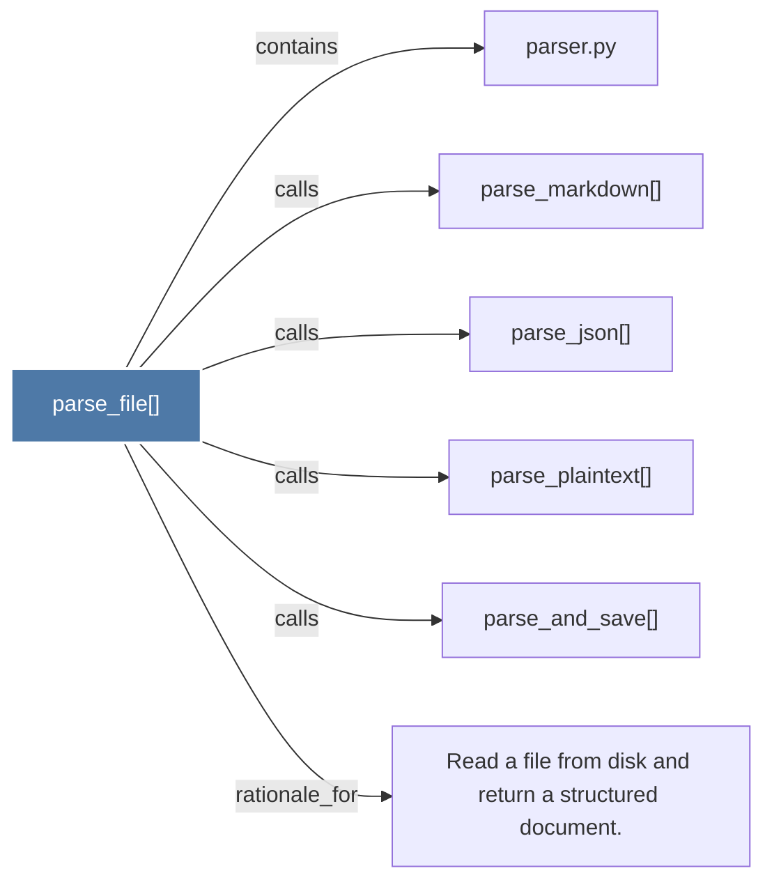

# parse_file()

> [!info] Properties
> **File Type**: code
> **Community**: [[_COMMUNITY_Community None|Community None]]
> **Degree**: 6

## Architecture Graph


## Outbound Connections
- [[Read a file from disk and return a structured document.]] - `rationale_for` [EXTRACTED]
- [[parse_and_save()]] - `calls` [EXTRACTED]
- [[parse_json()]] - `calls` [EXTRACTED]
- [[parse_markdown()]] - `calls` [EXTRACTED]
- [[parse_plaintext()]] - `calls` [EXTRACTED]
- [[parser.py]] - `contains` [EXTRACTED]

## Inbound Dependencies
> [!abstract]- Files that link here
```dataview
LIST
FROM [[parse_file()]]
```

#graphify/code #graphify/EXTRACTED #community/Community_None