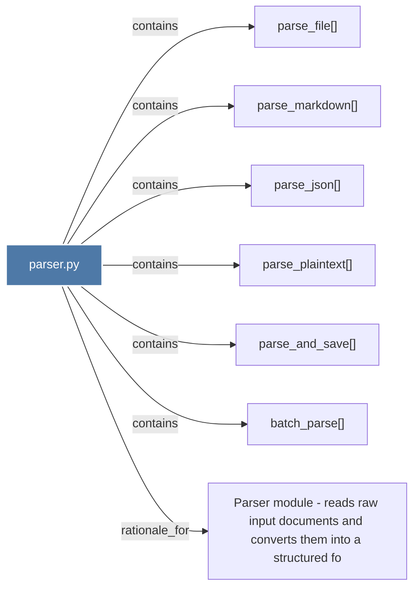

# parser.py

> [!info] Properties
> **File Type**: code
> **Community**: [[_COMMUNITY_Community None|Community None]]
> **Degree**: 7

## Architecture Graph


## Outbound Connections
- [[Parser module - reads raw input documents and converts them into a structured fo]] - `rationale_for` [EXTRACTED]
- [[batch_parse()]] - `contains` [EXTRACTED]
- [[parse_and_save()]] - `contains` [EXTRACTED]
- [[parse_file()]] - `contains` [EXTRACTED]
- [[parse_json()]] - `contains` [EXTRACTED]
- [[parse_markdown()]] - `contains` [EXTRACTED]
- [[parse_plaintext()]] - `contains` [EXTRACTED]

## Inbound Dependencies
> [!abstract]- Files that link here
```dataview
LIST
FROM [[parser.py]]
```

#graphify/code #graphify/EXTRACTED #community/Community_None