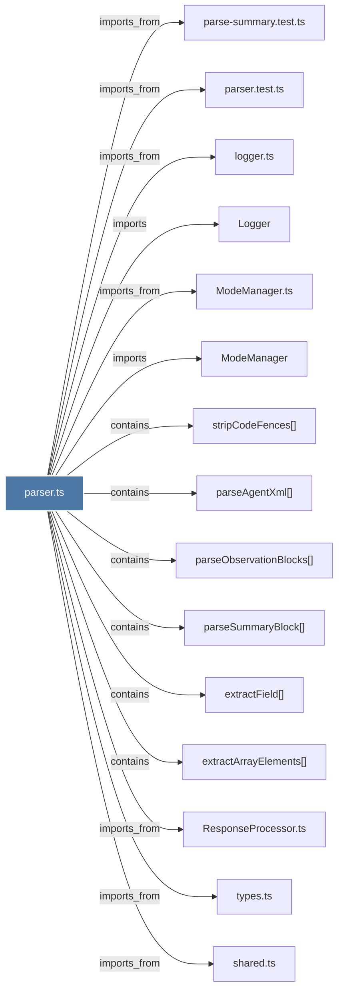

# parser.ts

> [!info] Properties
> **File Type**: code
> **Community**: [[_COMMUNITY_Community None|Community None]]
> **Degree**: 17

## Architecture Graph


## Outbound Connections
- [[ChromaSync.ts]] - `imports_from` [EXTRACTED]
- [[Logger]] - `imports` [EXTRACTED]
- [[ModeManager]] - `imports` [EXTRACTED]
- [[ModeManager.ts]] - `imports_from` [EXTRACTED]
- [[ResponseProcessor.ts]] - `imports_from` [EXTRACTED]
- [[TelegramNotifier.ts]] - `imports_from` [EXTRACTED]
- [[extractArrayElements()]] - `contains` [EXTRACTED]
- [[extractField()]] - `contains` [EXTRACTED]
- [[logger.ts]] - `imports_from` [EXTRACTED]
- [[parse-summary.test.ts]] - `imports_from` [EXTRACTED]
- [[parseAgentXml()]] - `contains` [EXTRACTED]
- [[parseObservationBlocks()]] - `contains` [EXTRACTED]
- [[parseSummaryBlock()]] - `contains` [EXTRACTED]
- [[parser.test.ts]] - `imports_from` [EXTRACTED]
- [[shared.ts]] - `imports_from` [EXTRACTED]
- [[stripCodeFences()]] - `contains` [EXTRACTED]
- [[types.ts_1]] - `imports_from` [EXTRACTED]

## Inbound Dependencies
> [!abstract]- Files that link here
```dataview
LIST
FROM [[parser.ts]]
```

#graphify/code #graphify/EXTRACTED #community/Community_None