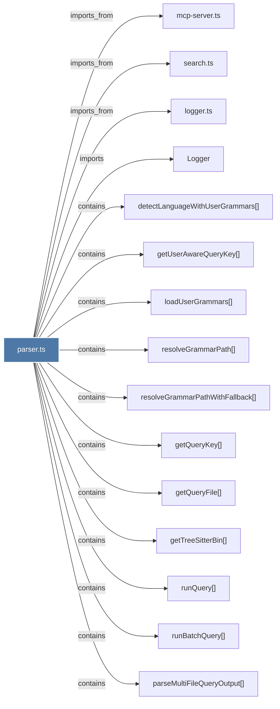

# parser.ts

> [!info] Properties
> **File Type**: code
> **Community**: [[_COMMUNITY_Community None|Community None]]
> **Degree**: 28

## Architecture Graph


## Outbound Connections
- [[Logger]] - `imports` [EXTRACTED]
- [[buildSymbols()]] - `contains` [EXTRACTED]
- [[detectLanguageWithUserGrammars()]] - `contains` [EXTRACTED]
- [[extractSignatureFromLines()]] - `contains` [EXTRACTED]
- [[findCommentAbove()]] - `contains` [EXTRACTED]
- [[findContainingHeadingLevel()]] - `contains` [EXTRACTED]
- [[findPythonDocstringFromLines()]] - `contains` [EXTRACTED]
- [[formatFoldedView()]] - `contains` [EXTRACTED]
- [[formatMarkdownFoldedView()]] - `contains` [EXTRACTED]
- [[formatSymbol()]] - `contains` [EXTRACTED]
- [[getQueryFile()]] - `contains` [EXTRACTED]
- [[getQueryKey()]] - `contains` [EXTRACTED]
- [[getSymbolIcon()]] - `contains` [EXTRACTED]
- [[getTreeSitterBin()]] - `contains` [EXTRACTED]
- [[getUserAwareQueryKey()]] - `contains` [EXTRACTED]
- [[isExported()]] - `contains` [EXTRACTED]
- [[loadUserGrammars()]] - `contains` [EXTRACTED]
- [[logger.ts]] - `imports_from` [EXTRACTED]
- [[mcp-server.ts]] - `imports_from` [EXTRACTED]
- [[parseFile()]] - `contains` [EXTRACTED]
- [[parseFilesBatch()]] - `contains` [EXTRACTED]
- [[parseMultiFileQueryOutput()]] - `contains` [EXTRACTED]
- [[resolveGrammarPath()]] - `contains` [EXTRACTED]
- [[resolveGrammarPathWithFallback()]] - `contains` [EXTRACTED]
- [[runBatchQuery()]] - `contains` [EXTRACTED]
- [[runQuery()]] - `contains` [EXTRACTED]
- [[search.ts]] - `imports_from` [EXTRACTED]
- [[unfoldSymbol()]] - `contains` [EXTRACTED]

## Inbound Dependencies
> [!abstract]- Files that link here
```dataview
LIST
FROM [[parser.ts_1]]
```

#graphify/code #graphify/EXTRACTED #community/Community_None