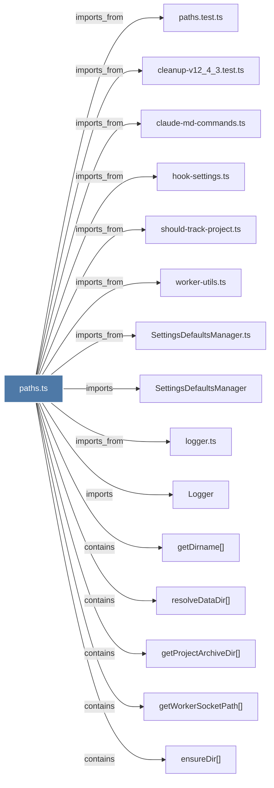

# paths.ts

> [!info] Properties
> **File Type**: code
> **Community**: [[_COMMUNITY_Community None|Community None]]
> **Degree**: 65

## Architecture Graph


## Outbound Connections
- [[.initializeBackground()]] - `imports_from` [EXTRACTED]
- [[BranchManager.ts]] - `imports_from` [EXTRACTED]
- [[ChromaMcpManager.ts]] - `imports_from` [EXTRACTED]
- [[ChromaRoutes.ts]] - `imports_from` [EXTRACTED]
- [[ClaudeProvider.ts]] - `imports_from` [EXTRACTED]
- [[CleanupV12_4_3.ts]] - `imports_from` [EXTRACTED]
- [[CodexCliInstaller.ts]] - `imports_from` [EXTRACTED]
- [[ContextConfigLoader.ts]] - `imports_from` [EXTRACTED]
- [[CorpusStore.ts]] - `imports_from` [EXTRACTED]
- [[CursorHooksInstaller.ts]] - `imports_from` [EXTRACTED]
- [[DataRoutes.ts]] - `imports_from` [EXTRACTED]
- [[Database.ts]] - `imports_from` [EXTRACTED]
- [[DatabaseManager.ts]] - `imports_from` [EXTRACTED]
- [[EnvManager.ts]] - `imports_from` [EXTRACTED]
- [[GeminiProvider.ts]] - `imports_from` [EXTRACTED]
- [[HealthMonitor.ts]] - `imports_from` [EXTRACTED]
- [[KnowledgeAgent.ts]] - `imports_from` [EXTRACTED]
- [[Logger]] - `imports` [EXTRACTED]
- [[ModeManager.ts]] - `imports_from` [EXTRACTED]
- [[ObservationCompiler.ts]] - `imports_from` [EXTRACTED]
- [[OpenRouterProvider.ts]] - `imports_from` [EXTRACTED]
- [[PaginationHelper.ts]] - `imports_from` [EXTRACTED]
- [[ProcessManager.ts]] - `imports_from` [EXTRACTED]
- [[ResponseProcessor.ts]] - `imports_from` [EXTRACTED]
- [[SearchRoutes.ts]] - `imports_from` [EXTRACTED]
- [[SessionRoutes.ts]] - `imports_from` [EXTRACTED]
- [[SessionSearch.ts]] - `imports_from` [EXTRACTED]
- [[SessionStore.ts]] - `imports_from` [EXTRACTED]
- [[SettingsDefaultsManager]] - `imports` [EXTRACTED]
- [[SettingsDefaultsManager.ts]] - `imports_from` [EXTRACTED]
- [[SettingsRoutes.ts]] - `imports_from` [EXTRACTED]
- [[TelegramNotifier.ts]] - `imports_from` [EXTRACTED]
- [[ViewerRoutes.ts]] - `imports_from` [EXTRACTED]
- [[WindsurfHooksInstaller.ts]] - `imports_from` [EXTRACTED]
- [[WorktreeAdoption.ts]] - `imports_from` [EXTRACTED]
- [[claude-md-commands.ts]] - `imports_from` [EXTRACTED]
- [[claude-md-utils.ts]] - `imports_from` [EXTRACTED]
- [[cleanup-v12_4_3.test.ts]] - `imports_from` [EXTRACTED]
- [[config.ts]] - `imports_from` [EXTRACTED]
- [[createBackupFilename()]] - `contains` [EXTRACTED]
- [[ensureAllClaudeDirs()]] - `contains` [EXTRACTED]
- [[ensureAllDataDirs()]] - `contains` [EXTRACTED]
- [[ensureDir()]] - `contains` [EXTRACTED]
- [[ensureModesDir()]] - `contains` [EXTRACTED]
- [[find-claude-executable.ts]] - `imports_from` [EXTRACTED]
- [[getCurrentProjectName()]] - `contains` [EXTRACTED]
- [[getDirname()]] - `contains` [EXTRACTED]
- [[getPackageCommandsDir()]] - `contains` [EXTRACTED]
- [[getPackageRoot()]] - `contains` [EXTRACTED]
- [[getProjectArchiveDir()]] - `contains` [EXTRACTED]
- [[getWorkerSocketPath()]] - `contains` [EXTRACTED]
- [[hook-settings.ts]] - `imports_from` [EXTRACTED]
- [[index.ts_11]] - `imports_from` [EXTRACTED]
- [[install.ts]] - `imports_from` [EXTRACTED]
- [[logger.ts]] - `imports_from` [EXTRACTED]
- [[middleware.ts]] - `imports_from` [EXTRACTED]
- [[paths.test.ts]] - `imports_from` [EXTRACTED]
- [[process-registry.ts]] - `imports_from` [EXTRACTED]
- [[processor.ts]] - `imports_from` [EXTRACTED]
- [[queries.ts]] - `imports_from` [EXTRACTED]
- [[resolveDataDir()]] - `contains` [EXTRACTED]
- [[shared.ts]] - `imports_from` [EXTRACTED]
- [[should-track-project.ts]] - `imports_from` [EXTRACTED]
- [[shutdown.ts]] - `imports_from` [EXTRACTED]
- [[worker-utils.ts]] - `imports_from` [EXTRACTED]

## Inbound Dependencies
> [!abstract]- Files that link here
```dataview
LIST
FROM [[paths.ts]]
```

#graphify/code #graphify/EXTRACTED #community/Community_None