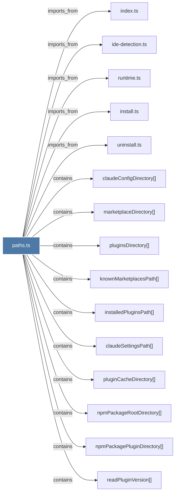

# paths.ts

> [!info] Properties
> **File Type**: code
> **Community**: [[_COMMUNITY_Community None|Community None]]
> **Degree**: 19

## Architecture Graph


## Outbound Connections
- [[bun-resolver.ts]] - `imports_from` [EXTRACTED]
- [[claudeConfigDirectory()]] - `contains` [EXTRACTED]
- [[claudeSettingsPath()]] - `contains` [EXTRACTED]
- [[ensureDirectoryExists()]] - `contains` [EXTRACTED]
- [[ide-detection.ts]] - `imports_from` [EXTRACTED]
- [[index.ts_3]] - `imports_from` [EXTRACTED]
- [[install.ts]] - `imports_from` [EXTRACTED]
- [[installedPluginsPath()]] - `contains` [EXTRACTED]
- [[isPluginInstalled()]] - `contains` [EXTRACTED]
- [[knownMarketplacesPath()]] - `contains` [EXTRACTED]
- [[marketplaceDirectory()]] - `contains` [EXTRACTED]
- [[npmPackagePluginDirectory()]] - `contains` [EXTRACTED]
- [[npmPackageRootDirectory()]] - `contains` [EXTRACTED]
- [[pluginCacheDirectory()]] - `contains` [EXTRACTED]
- [[pluginsDirectory()]] - `contains` [EXTRACTED]
- [[readPluginVersion()]] - `contains` [EXTRACTED]
- [[runtime.ts]] - `imports_from` [EXTRACTED]
- [[uninstall.ts]] - `imports_from` [EXTRACTED]
- [[writeJsonFileAtomic()]] - `contains` [EXTRACTED]

## Inbound Dependencies
> [!abstract]- Files that link here
```dataview
LIST
FROM [[paths.ts_1]]
```

#graphify/code #graphify/EXTRACTED #community/Community_None