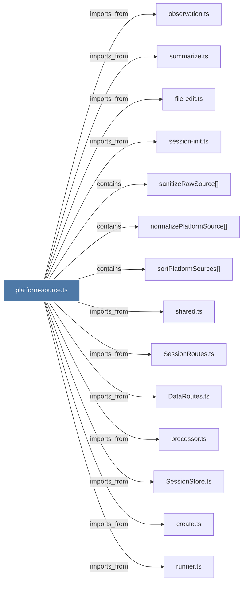

# platform-source.ts

> [!info] Properties
> **File Type**: code
> **Community**: [[_COMMUNITY_Community None|Community None]]
> **Degree**: 14

## Architecture Graph


## Outbound Connections
- [[DataRoutes.ts]] - `imports_from` [EXTRACTED]
- [[SessionRoutes.ts]] - `imports_from` [EXTRACTED]
- [[SessionStore.ts]] - `imports_from` [EXTRACTED]
- [[create.ts]] - `imports_from` [EXTRACTED]
- [[file-edit.ts]] - `imports_from` [EXTRACTED]
- [[normalizePlatformSource()]] - `contains` [EXTRACTED]
- [[observation.ts]] - `imports_from` [EXTRACTED]
- [[processor.ts]] - `imports_from` [EXTRACTED]
- [[runner.ts]] - `imports_from` [EXTRACTED]
- [[sanitizeRawSource()]] - `contains` [EXTRACTED]
- [[session-init.ts]] - `imports_from` [EXTRACTED]
- [[shared.ts]] - `imports_from` [EXTRACTED]
- [[sortPlatformSources()]] - `contains` [EXTRACTED]
- [[summarize.ts]] - `imports_from` [EXTRACTED]

## Inbound Dependencies
> [!abstract]- Files that link here
```dataview
LIST
FROM [[platform-source.ts]]
```

#graphify/code #graphify/EXTRACTED #community/Community_None