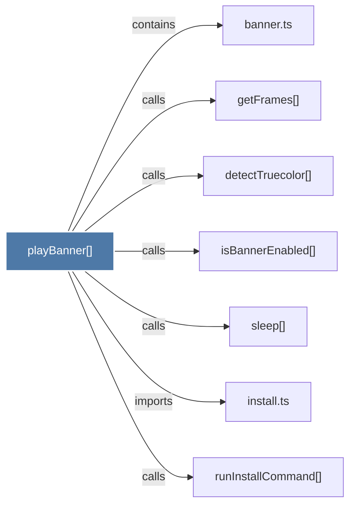

# playBanner()

> [!info] Properties
> **File Type**: code
> **Community**: [[_COMMUNITY_Community None|Community None]]
> **Degree**: 7

## Architecture Graph


## Outbound Connections
- [[banner.ts]] - `contains` [EXTRACTED]
- [[detectTruecolor()]] - `calls` [EXTRACTED]
- [[getFrames()]] - `calls` [EXTRACTED]
- [[install.ts]] - `imports` [EXTRACTED]
- [[isBannerEnabled()]] - `calls` [EXTRACTED]
- [[runInstallCommand()]] - `calls` [INFERRED]
- [[sleep()_1]] - `calls` [EXTRACTED]

## Inbound Dependencies
> [!abstract]- Files that link here
```dataview
LIST
FROM [[playBanner()]]
```

#graphify/code #graphify/EXTRACTED #community/Community_None