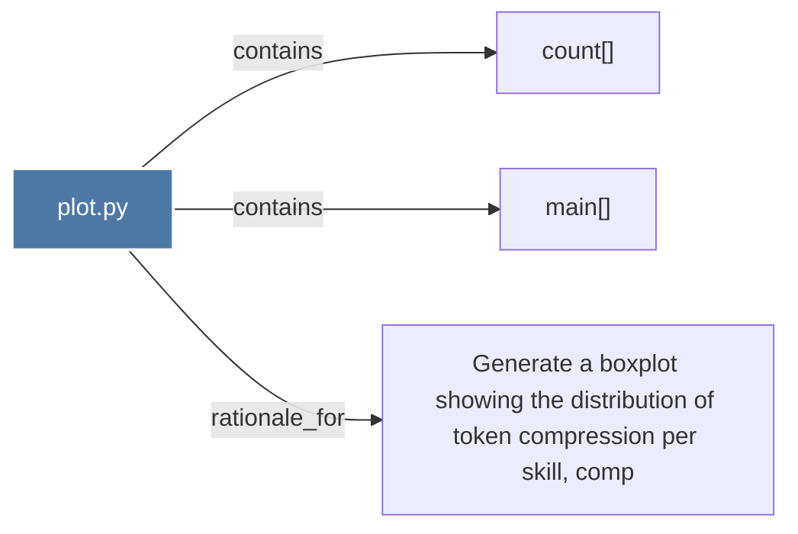

# plot.py

> [!info] Properties
> **File Type**: code
> **Community**: [[_COMMUNITY_Community None|Community None]]
> **Degree**: 3

## Architecture Graph


## Outbound Connections
- [[Generate a boxplot showing the distribution of token compression per skill, comp]] - `rationale_for` [EXTRACTED]
- [[count()]] - `contains` [EXTRACTED]
- [[main()_15]] - `contains` [EXTRACTED]

## Inbound Dependencies
> [!abstract]- Files that link here
```dataview
LIST
FROM [[plot.py]]
```

#graphify/code #graphify/EXTRACTED #community/Community_None