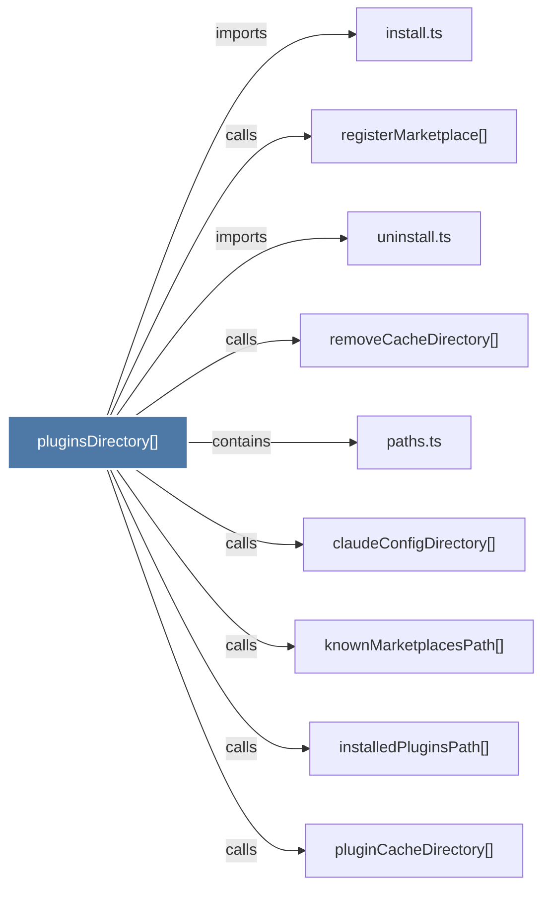

# pluginsDirectory()

> [!info] Properties
> **File Type**: code
> **Community**: [[_COMMUNITY_Community None|Community None]]
> **Degree**: 9

## Architecture Graph


## Outbound Connections
- [[claudeConfigDirectory()]] - `calls` [EXTRACTED]
- [[install.ts]] - `imports` [EXTRACTED]
- [[installedPluginsPath()]] - `calls` [EXTRACTED]
- [[knownMarketplacesPath()]] - `calls` [EXTRACTED]
- [[paths.ts_1]] - `contains` [EXTRACTED]
- [[pluginCacheDirectory()]] - `calls` [EXTRACTED]
- [[registerMarketplace()]] - `calls` [INFERRED]
- [[removeCacheDirectory()]] - `calls` [INFERRED]
- [[uninstall.ts]] - `imports` [EXTRACTED]

## Inbound Dependencies
> [!abstract]- Files that link here
```dataview
LIST
FROM [[pluginsDirectory()]]
```

#graphify/code #graphify/EXTRACTED #community/Community_None