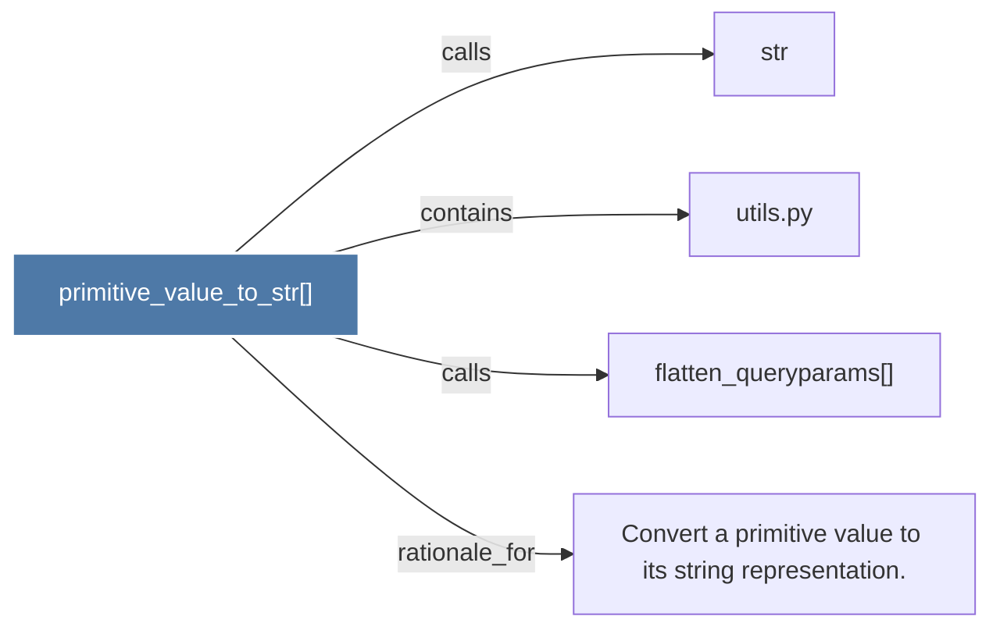

# primitive_value_to_str()

> [!info] Properties
> **File Type**: code
> **Community**: [[_COMMUNITY_Community None|Community None]]
> **Degree**: 4

## Architecture Graph


## Outbound Connections
- [[Convert a primitive value to its string representation.]] - `rationale_for` [EXTRACTED]
- [[flatten_queryparams()]] - `calls` [EXTRACTED]
- [[str]] - `calls` [INFERRED]
- [[utils.py]] - `contains` [EXTRACTED]

## Inbound Dependencies
> [!abstract]- Files that link here
```dataview
LIST
FROM [[primitive_value_to_str()]]
```

#graphify/code #graphify/EXTRACTED #community/Community_None