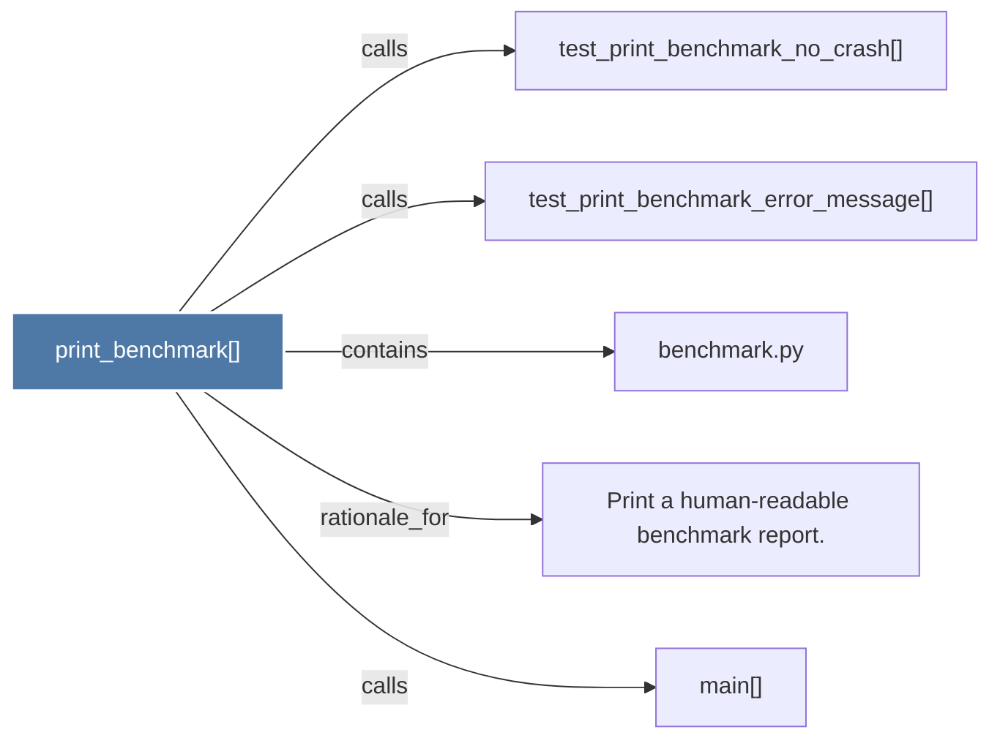

# print_benchmark()

> [!info] Properties
> **File Type**: code
> **Community**: [[_COMMUNITY_Community None|Community None]]
> **Degree**: 5

## Architecture Graph


## Outbound Connections
- [[Print a human-readable benchmark report.]] - `rationale_for` [EXTRACTED]
- [[benchmark.py]] - `contains` [EXTRACTED]
- [[main()_2]] - `calls` [INFERRED]
- [[test_print_benchmark_error_message()]] - `calls` [INFERRED]
- [[test_print_benchmark_no_crash()]] - `calls` [INFERRED]

## Inbound Dependencies
> [!abstract]- Files that link here
```dataview
LIST
FROM [[print_benchmark()]]
```

#graphify/code #graphify/INFERRED #community/Community_None