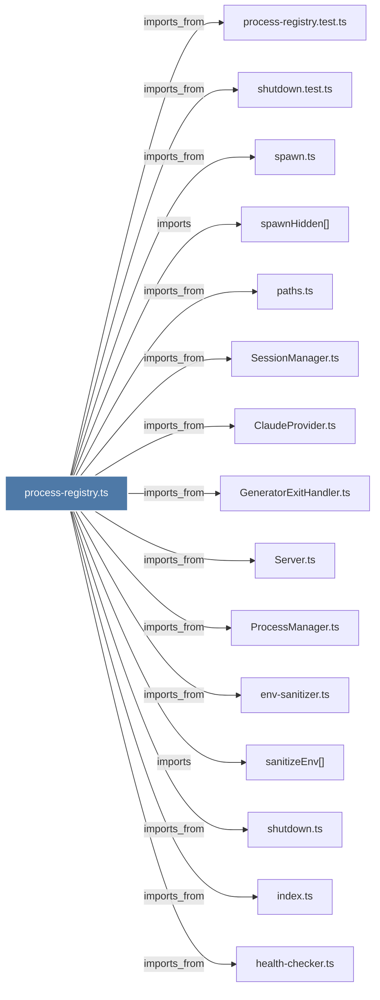

# process-registry.ts

> [!info] Properties
> **File Type**: code
> **Community**: [[_COMMUNITY_Community None|Community None]]
> **Degree**: 30

## Architecture Graph


## Outbound Connections
- [[ClaudeProvider.ts]] - `imports_from` [EXTRACTED]
- [[GeneratorExitHandler.ts]] - `imports_from` [EXTRACTED]
- [[Logger]] - `imports` [EXTRACTED]
- [[ProcessManager.ts]] - `imports_from` [EXTRACTED]
- [[ProcessRegistry]] - `contains` [EXTRACTED]
- [[Server.ts]] - `imports_from` [EXTRACTED]
- [[SessionManager.ts]] - `imports_from` [EXTRACTED]
- [[captureProcessStartToken()]] - `contains` [EXTRACTED]
- [[createProcessRegistry()]] - `contains` [EXTRACTED]
- [[createSdkSpawnFactory()]] - `contains` [EXTRACTED]
- [[ensureSdkProcessExit()]] - `contains` [EXTRACTED]
- [[env-sanitizer.ts]] - `imports_from` [EXTRACTED]
- [[getActiveSdkCount()]] - `contains` [EXTRACTED]
- [[getProcessRegistry()]] - `contains` [EXTRACTED]
- [[getSdkProcessForSession()]] - `contains` [EXTRACTED]
- [[health-checker.ts]] - `imports_from` [EXTRACTED]
- [[index.ts_11]] - `imports_from` [EXTRACTED]
- [[isPidAlive()]] - `contains` [EXTRACTED]
- [[logger.ts]] - `imports_from` [EXTRACTED]
- [[notifySlotAvailable()]] - `contains` [EXTRACTED]
- [[paths.ts]] - `imports_from` [EXTRACTED]
- [[process-registry.test.ts]] - `imports_from` [EXTRACTED]
- [[sanitizeEnv()]] - `imports` [EXTRACTED]
- [[shutdown.test.ts]] - `imports_from` [EXTRACTED]
- [[shutdown.ts]] - `imports_from` [EXTRACTED]
- [[spawn.ts]] - `imports_from` [EXTRACTED]
- [[spawnHidden()]] - `imports` [EXTRACTED]
- [[spawnSdkProcess()]] - `contains` [EXTRACTED]
- [[verifyPidFileOwnership()]] - `contains` [EXTRACTED]
- [[waitForSlot()]] - `contains` [EXTRACTED]

## Inbound Dependencies
> [!abstract]- Files that link here
```dataview
LIST
FROM [[process-registry.ts]]
```

#graphify/code #graphify/EXTRACTED #community/Community_None