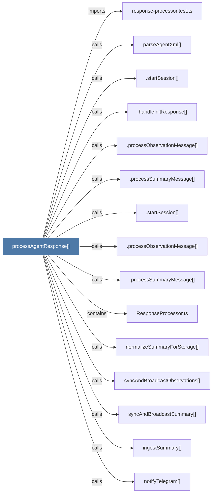

# processAgentResponse()

> [!info] Properties
> **File Type**: code
> **Community**: [[_COMMUNITY_Community None|Community None]]
> **Degree**: 15

## Architecture Graph


## Outbound Connections
- [[.handleInitResponse()]] - `calls` [INFERRED]
- [[.processObservationMessage()]] - `calls` [INFERRED]
- [[.processObservationMessage()_1]] - `calls` [INFERRED]
- [[.processSummaryMessage()]] - `calls` [INFERRED]
- [[.processSummaryMessage()_1]] - `calls` [INFERRED]
- [[.startSession()]] - `calls` [INFERRED]
- [[.startSession()_2]] - `calls` [INFERRED]
- [[ResponseProcessor.ts]] - `contains` [EXTRACTED]
- [[ingestSummary()]] - `calls` [INFERRED]
- [[normalizeSummaryForStorage()]] - `calls` [EXTRACTED]
- [[notifyTelegram()]] - `calls` [INFERRED]
- [[parseAgentXml()]] - `calls` [INFERRED]
- [[response-processor.test.ts]] - `imports` [EXTRACTED]
- [[syncAndBroadcastObservations()]] - `calls` [EXTRACTED]
- [[syncAndBroadcastSummary()]] - `calls` [EXTRACTED]

## Inbound Dependencies
> [!abstract]- Files that link here
```dataview
LIST
FROM [[processAgentResponse()]]
```

#graphify/code #graphify/INFERRED #community/Community_None