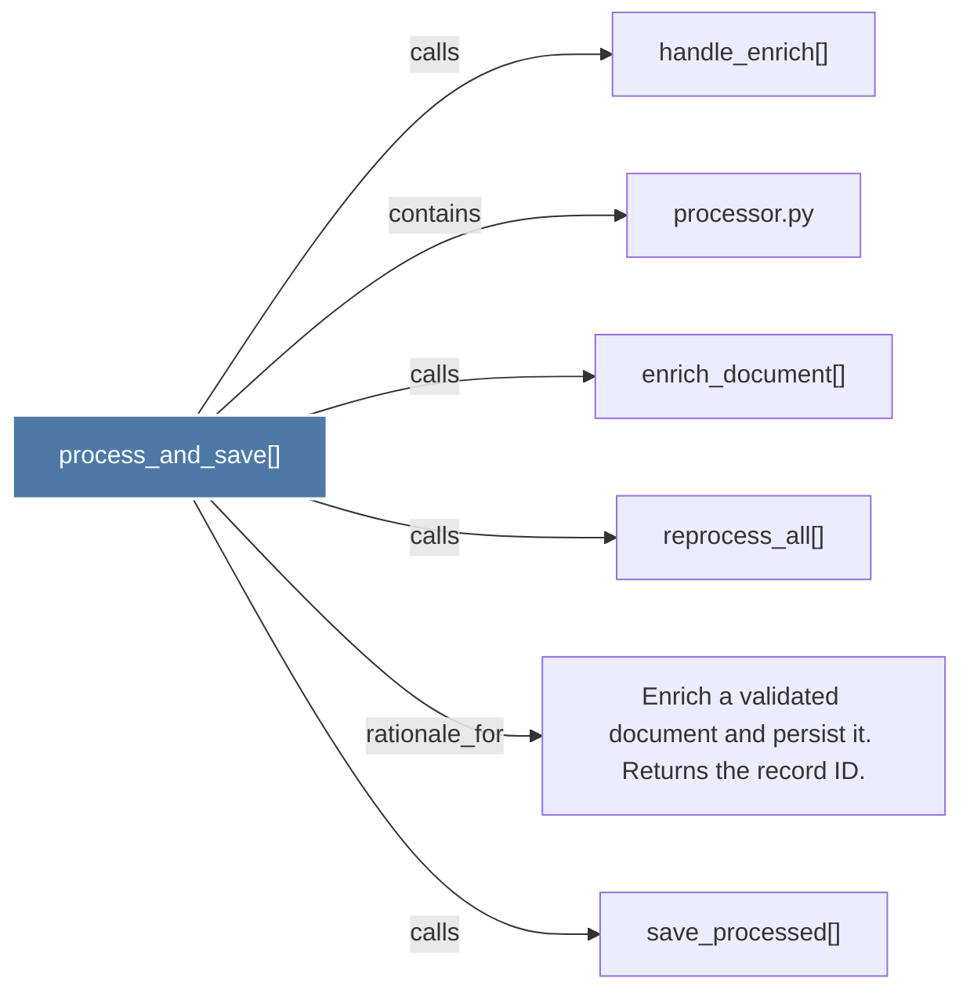

# process_and_save()

> [!info] Properties
> **File Type**: code
> **Community**: [[_COMMUNITY_Community None|Community None]]
> **Degree**: 6

## Architecture Graph


## Outbound Connections
- [[Enrich a validated document and persist it. Returns the record ID.]] - `rationale_for` [EXTRACTED]
- [[enrich_document()]] - `calls` [EXTRACTED]
- [[handle_enrich()]] - `calls` [INFERRED]
- [[processor.py]] - `contains` [EXTRACTED]
- [[reprocess_all()]] - `calls` [EXTRACTED]
- [[save_processed()]] - `calls` [INFERRED]

## Inbound Dependencies
> [!abstract]- Files that link here
```dataview
LIST
FROM [[process_and_save()]]
```

#graphify/code #graphify/EXTRACTED #community/Community_None