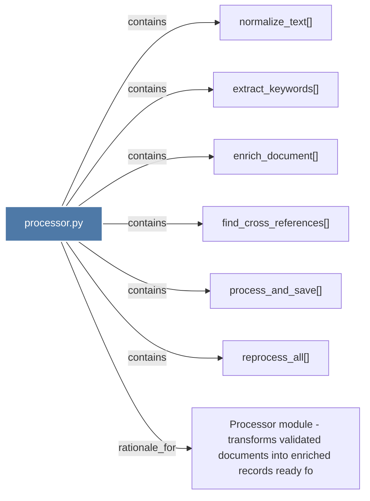

# processor.py

> [!info] Properties
> **File Type**: code
> **Community**: [[_COMMUNITY_Community None|Community None]]
> **Degree**: 7

## Architecture Graph


## Outbound Connections
- [[Processor module - transforms validated documents into enriched records ready fo]] - `rationale_for` [EXTRACTED]
- [[enrich_document()]] - `contains` [EXTRACTED]
- [[extract_keywords()]] - `contains` [EXTRACTED]
- [[find_cross_references()]] - `contains` [EXTRACTED]
- [[normalize_text()]] - `contains` [EXTRACTED]
- [[process_and_save()]] - `contains` [EXTRACTED]
- [[reprocess_all()]] - `contains` [EXTRACTED]

## Inbound Dependencies
> [!abstract]- Files that link here
```dataview
LIST
FROM [[processor.py]]
```

#graphify/code #graphify/EXTRACTED #community/Community_None