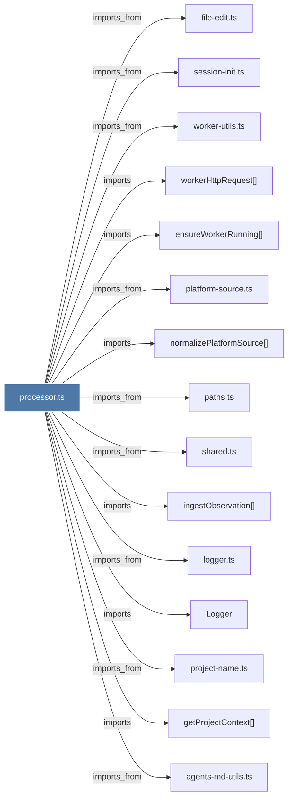

# processor.ts

> [!info] Properties
> **File Type**: code
> **Community**: [[_COMMUNITY_Community None|Community None]]
> **Degree**: 25

## Architecture Graph


## Outbound Connections
- [[Logger]] - `imports` [EXTRACTED]
- [[TranscriptEventProcessor]] - `contains` [EXTRACTED]
- [[agents-md-utils.ts]] - `imports_from` [EXTRACTED]
- [[config.ts]] - `imports_from` [EXTRACTED]
- [[ensureWorkerRunning()]] - `imports` [EXTRACTED]
- [[expandHomePath()]] - `imports` [EXTRACTED]
- [[field-utils.ts]] - `imports_from` [EXTRACTED]
- [[file-edit.ts]] - `imports_from` [EXTRACTED]
- [[getProjectContext()]] - `imports` [EXTRACTED]
- [[ingestObservation()]] - `imports` [EXTRACTED]
- [[logger.ts]] - `imports_from` [EXTRACTED]
- [[matchesRule()]] - `imports` [EXTRACTED]
- [[normalizePlatformSource()]] - `imports` [EXTRACTED]
- [[paths.ts]] - `imports_from` [EXTRACTED]
- [[platform-source.ts]] - `imports_from` [EXTRACTED]
- [[project-name.ts]] - `imports_from` [EXTRACTED]
- [[resolveFieldSpec()]] - `imports` [EXTRACTED]
- [[resolveFields()]] - `imports` [EXTRACTED]
- [[session-init.ts]] - `imports_from` [EXTRACTED]
- [[shared.ts]] - `imports_from` [EXTRACTED]
- [[types.ts_4]] - `imports_from` [EXTRACTED]
- [[watcher.ts]] - `imports_from` [EXTRACTED]
- [[worker-utils.ts]] - `imports_from` [EXTRACTED]
- [[workerHttpRequest()]] - `imports` [EXTRACTED]
- [[writeAgentsMd()]] - `imports` [EXTRACTED]

## Inbound Dependencies
> [!abstract]- Files that link here
```dataview
LIST
FROM [[processor.ts]]
```

#graphify/code #graphify/EXTRACTED #community/Community_None