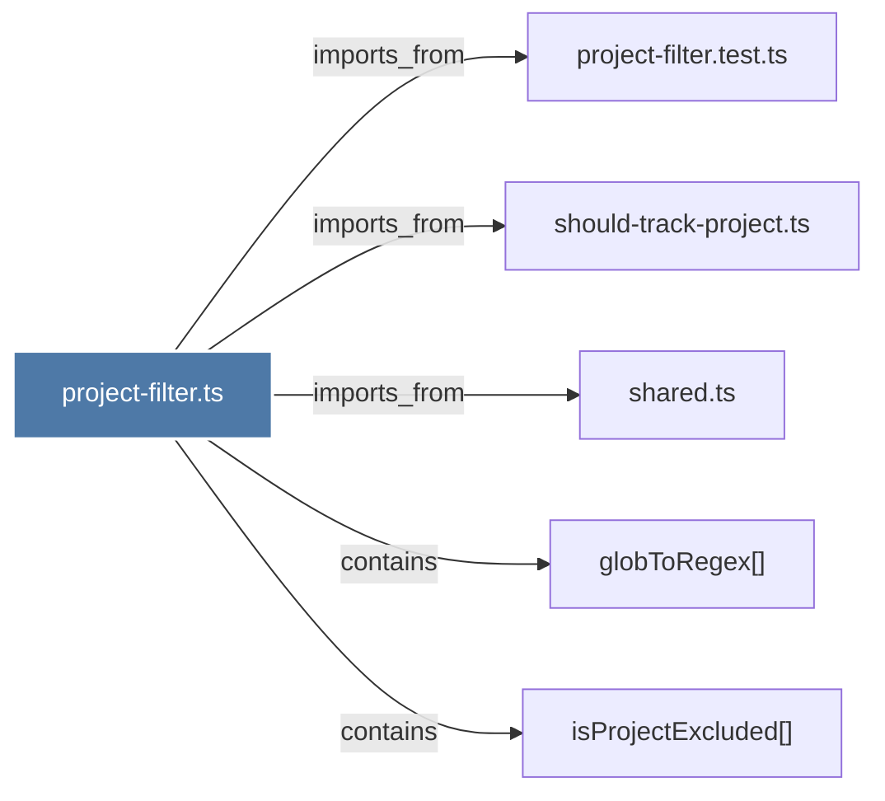

# project-filter.ts

> [!info] Properties
> **File Type**: code
> **Community**: [[_COMMUNITY_Community None|Community None]]
> **Degree**: 5

## Architecture Graph


## Outbound Connections
- [[globToRegex()]] - `contains` [EXTRACTED]
- [[isProjectExcluded()]] - `contains` [EXTRACTED]
- [[project-filter.test.ts]] - `imports_from` [EXTRACTED]
- [[shared.ts]] - `imports_from` [EXTRACTED]
- [[should-track-project.ts]] - `imports_from` [EXTRACTED]

## Inbound Dependencies
> [!abstract]- Files that link here
```dataview
LIST
FROM [[project-filter.ts]]
```

#graphify/code #graphify/EXTRACTED #community/Community_None