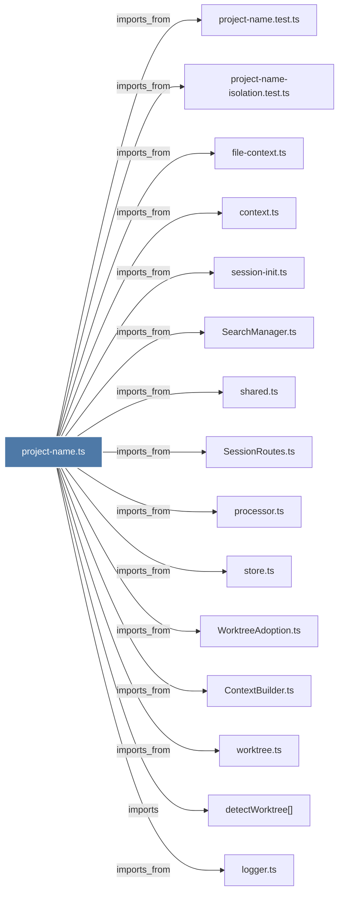

# project-name.ts

> [!info] Properties
> **File Type**: code
> **Community**: [[_COMMUNITY_Community None|Community None]]
> **Degree**: 19

## Architecture Graph


## Outbound Connections
- [[ContextBuilder.ts]] - `imports_from` [EXTRACTED]
- [[Logger]] - `imports` [EXTRACTED]
- [[SearchManager.ts]] - `imports_from` [EXTRACTED]
- [[SessionRoutes.ts]] - `imports_from` [EXTRACTED]
- [[WorktreeAdoption.ts]] - `imports_from` [EXTRACTED]
- [[context.ts]] - `imports_from` [EXTRACTED]
- [[detectWorktree()]] - `imports` [EXTRACTED]
- [[expandTilde()]] - `contains` [EXTRACTED]
- [[file-context.ts]] - `imports_from` [EXTRACTED]
- [[getProjectContext()]] - `contains` [EXTRACTED]
- [[getProjectName()]] - `contains` [EXTRACTED]
- [[logger.ts]] - `imports_from` [EXTRACTED]
- [[processor.ts]] - `imports_from` [EXTRACTED]
- [[project-name-isolation.test.ts]] - `imports_from` [EXTRACTED]
- [[project-name.test.ts]] - `imports_from` [EXTRACTED]
- [[session-init.ts]] - `imports_from` [EXTRACTED]
- [[shared.ts]] - `imports_from` [EXTRACTED]
- [[store.ts]] - `imports_from` [EXTRACTED]
- [[worktree.ts]] - `imports_from` [EXTRACTED]

## Inbound Dependencies
> [!abstract]- Files that link here
```dataview
LIST
FROM [[project-name.ts]]
```

#graphify/code #graphify/EXTRACTED #community/Community_None