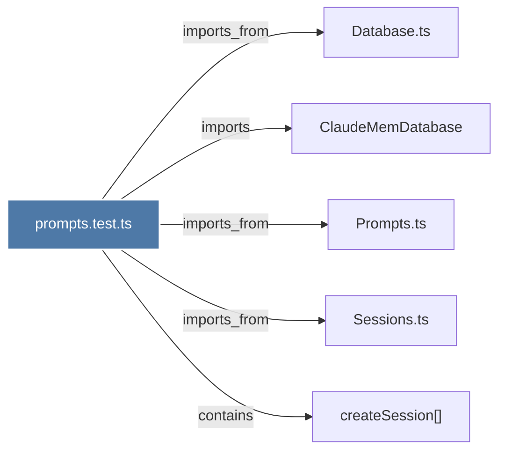

# prompts.test.ts

> [!info] Properties
> **File Type**: code
> **Community**: [[_COMMUNITY_Community None|Community None]]
> **Degree**: 5

## Architecture Graph


## Outbound Connections
- [[ClaudeMemDatabase]] - `imports` [EXTRACTED]
- [[Database.ts]] - `imports_from` [EXTRACTED]
- [[Prompts.ts]] - `imports_from` [EXTRACTED]
- [[Sessions.ts]] - `imports_from` [EXTRACTED]
- [[createSession()]] - `contains` [EXTRACTED]

## Inbound Dependencies
> [!abstract]- Files that link here
```dataview
LIST
FROM [[prompts.test.ts_1]]
```

#graphify/code #graphify/EXTRACTED #community/Community_None