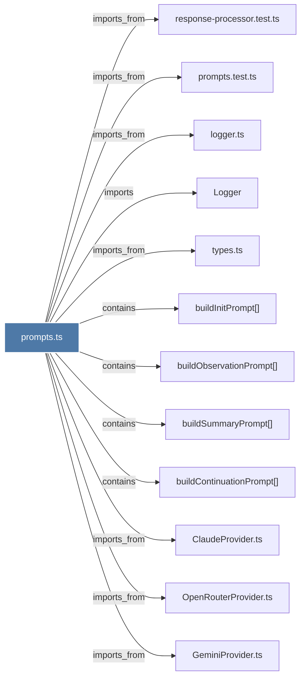

# prompts.ts

> [!info] Properties
> **File Type**: code
> **Community**: [[_COMMUNITY_Community None|Community None]]
> **Degree**: 12

## Architecture Graph


## Outbound Connections
- [[ClaudeProvider.ts]] - `imports_from` [EXTRACTED]
- [[GeminiProvider.ts]] - `imports_from` [EXTRACTED]
- [[Logger]] - `imports` [EXTRACTED]
- [[OpenRouterProvider.ts]] - `imports_from` [EXTRACTED]
- [[buildContinuationPrompt()]] - `contains` [EXTRACTED]
- [[buildInitPrompt()]] - `contains` [EXTRACTED]
- [[buildObservationPrompt()]] - `contains` [EXTRACTED]
- [[buildSummaryPrompt()]] - `contains` [EXTRACTED]
- [[logger.ts]] - `imports_from` [EXTRACTED]
- [[prompts.test.ts]] - `imports_from` [EXTRACTED]
- [[response-processor.test.ts]] - `imports_from` [EXTRACTED]
- [[types.ts_5]] - `imports_from` [EXTRACTED]

## Inbound Dependencies
> [!abstract]- Files that link here
```dataview
LIST
FROM [[prompts.ts]]
```

#graphify/code #graphify/EXTRACTED #community/Community_None