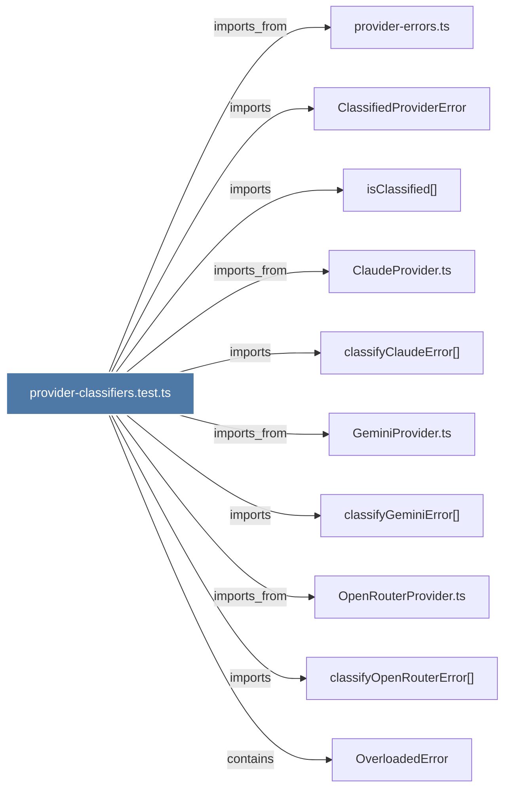

# provider-classifiers.test.ts

> [!info] Properties
> **File Type**: code
> **Community**: [[_COMMUNITY_Community None|Community None]]
> **Degree**: 10

## Architecture Graph


## Outbound Connections
- [[ClassifiedProviderError]] - `imports` [EXTRACTED]
- [[ClaudeProvider.ts]] - `imports_from` [EXTRACTED]
- [[GeminiProvider.ts]] - `imports_from` [EXTRACTED]
- [[OpenRouterProvider.ts]] - `imports_from` [EXTRACTED]
- [[OverloadedError_1]] - `contains` [EXTRACTED]
- [[classifyClaudeError()]] - `imports` [EXTRACTED]
- [[classifyGeminiError()]] - `imports` [EXTRACTED]
- [[classifyOpenRouterError()]] - `imports` [EXTRACTED]
- [[isClassified()]] - `imports` [EXTRACTED]
- [[provider-errors.ts]] - `imports_from` [EXTRACTED]

## Inbound Dependencies
> [!abstract]- Files that link here
```dataview
LIST
FROM [[provider-classifiers.test.ts]]
```

#graphify/code #graphify/EXTRACTED #community/Community_None