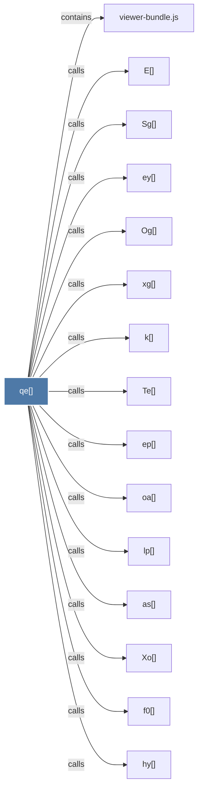

# qe()

> [!info] Properties
> **File Type**: code
> **Community**: [[_COMMUNITY_Community None|Community None]]
> **Degree**: 23

## Architecture Graph


## Outbound Connections
- [[E()]] - `calls` [EXTRACTED]
- [[Nh()]] - `calls` [EXTRACTED]
- [[Og()]] - `calls` [EXTRACTED]
- [[Sg()]] - `calls` [EXTRACTED]
- [[Te()]] - `calls` [EXTRACTED]
- [[Xo()]] - `calls` [EXTRACTED]
- [[as()]] - `calls` [EXTRACTED]
- [[by()]] - `calls` [EXTRACTED]
- [[ep()]] - `calls` [EXTRACTED]
- [[ey()]] - `calls` [EXTRACTED]
- [[f0()]] - `calls` [EXTRACTED]
- [[gy()]] - `calls` [EXTRACTED]
- [[hy()]] - `calls` [EXTRACTED]
- [[k()]] - `calls` [EXTRACTED]
- [[lp()]] - `calls` [EXTRACTED]
- [[oa()]] - `calls` [EXTRACTED]
- [[od()]] - `calls` [EXTRACTED]
- [[qy()]] - `calls` [EXTRACTED]
- [[ry()]] - `calls` [EXTRACTED]
- [[viewer-bundle.js]] - `contains` [EXTRACTED]
- [[wy()]] - `calls` [EXTRACTED]
- [[xg()]] - `calls` [EXTRACTED]
- [[yy()]] - `calls` [EXTRACTED]

## Inbound Dependencies
> [!abstract]- Files that link here
```dataview
LIST
FROM [[qe()]]
```

#graphify/code #graphify/EXTRACTED #community/Community_None