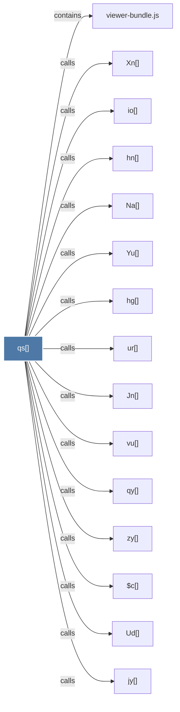

# qs()

> [!info] Properties
> **File Type**: code
> **Community**: [[_COMMUNITY_Community None|Community None]]
> **Degree**: 18

## Architecture Graph


## Outbound Connections
- [[$c()]] - `calls` [EXTRACTED]
- [[$t()]] - `calls` [EXTRACTED]
- [[Jn()]] - `calls` [EXTRACTED]
- [[Na()]] - `calls` [EXTRACTED]
- [[Ud()]] - `calls` [EXTRACTED]
- [[Vs()]] - `calls` [EXTRACTED]
- [[Xn()]] - `calls` [EXTRACTED]
- [[Yu()]] - `calls` [EXTRACTED]
- [[hg()]] - `calls` [EXTRACTED]
- [[hn()]] - `calls` [EXTRACTED]
- [[io()]] - `calls` [EXTRACTED]
- [[jy()]] - `calls` [EXTRACTED]
- [[qy()]] - `calls` [EXTRACTED]
- [[rt()]] - `calls` [EXTRACTED]
- [[ur()]] - `calls` [EXTRACTED]
- [[viewer-bundle.js]] - `contains` [EXTRACTED]
- [[vu()]] - `calls` [EXTRACTED]
- [[zy()]] - `calls` [EXTRACTED]

## Inbound Dependencies
> [!abstract]- Files that link here
```dataview
LIST
FROM [[qs()]]
```

#graphify/code #graphify/EXTRACTED #community/Community_None