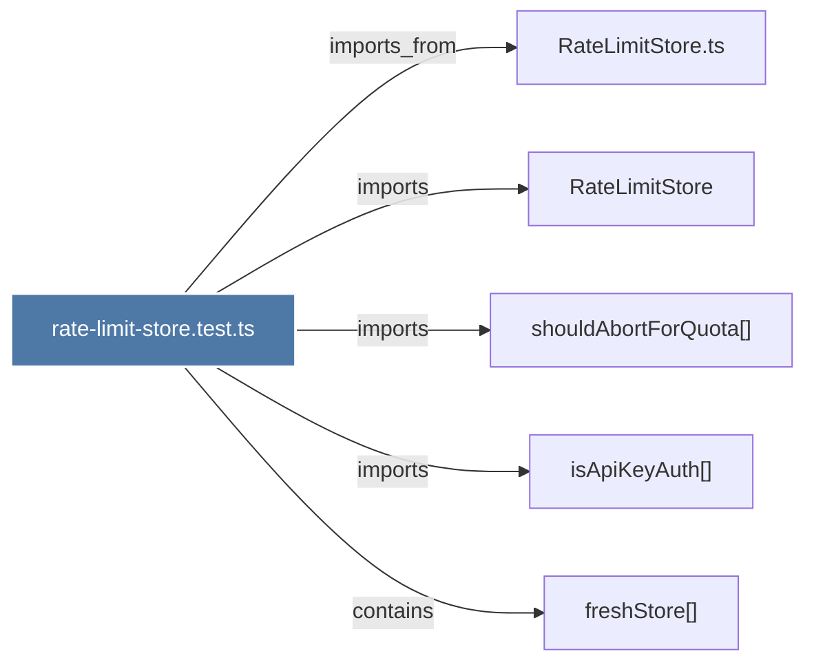

# rate-limit-store.test.ts

> [!info] Properties
> **File Type**: code
> **Community**: [[_COMMUNITY_Community None|Community None]]
> **Degree**: 5

## Architecture Graph


## Outbound Connections
- [[RateLimitStore]] - `imports` [EXTRACTED]
- [[RateLimitStore.ts]] - `imports_from` [EXTRACTED]
- [[freshStore()]] - `contains` [EXTRACTED]
- [[isApiKeyAuth()]] - `imports` [EXTRACTED]
- [[shouldAbortForQuota()]] - `imports` [EXTRACTED]

## Inbound Dependencies
> [!abstract]- Files that link here
```dataview
LIST
FROM [[rate-limit-store.test.ts]]
```

#graphify/code #graphify/EXTRACTED #community/Community_None