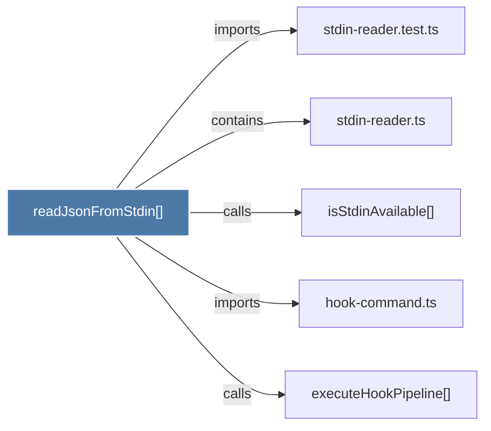

# readJsonFromStdin()

> [!info] Properties
> **File Type**: code
> **Community**: [[_COMMUNITY_Community None|Community None]]
> **Degree**: 5

## Architecture Graph


## Outbound Connections
- [[executeHookPipeline()]] - `calls` [INFERRED]
- [[hook-command.ts]] - `imports` [EXTRACTED]
- [[isStdinAvailable()]] - `calls` [EXTRACTED]
- [[stdin-reader.test.ts]] - `imports` [EXTRACTED]
- [[stdin-reader.ts]] - `contains` [EXTRACTED]

## Inbound Dependencies
> [!abstract]- Files that link here
```dataview
LIST
FROM [[readJsonFromStdin()]]
```

#graphify/code #graphify/EXTRACTED #community/Community_None