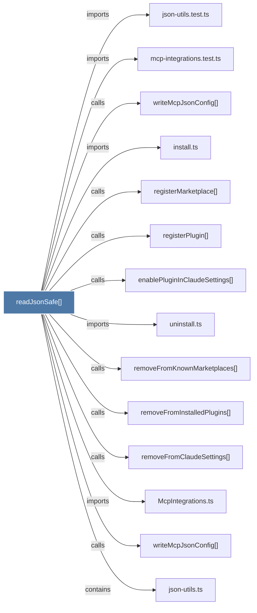

# readJsonSafe()

> [!info] Properties
> **File Type**: code
> **Community**: [[_COMMUNITY_Community None|Community None]]
> **Degree**: 14

## Architecture Graph


## Outbound Connections
- [[McpIntegrations.ts]] - `imports` [EXTRACTED]
- [[enablePluginInClaudeSettings()]] - `calls` [INFERRED]
- [[install.ts]] - `imports` [EXTRACTED]
- [[json-utils.test.ts]] - `imports` [EXTRACTED]
- [[json-utils.ts]] - `contains` [EXTRACTED]
- [[mcp-integrations.test.ts]] - `imports` [EXTRACTED]
- [[registerMarketplace()]] - `calls` [INFERRED]
- [[registerPlugin()]] - `calls` [INFERRED]
- [[removeFromClaudeSettings()]] - `calls` [INFERRED]
- [[removeFromInstalledPlugins()]] - `calls` [INFERRED]
- [[removeFromKnownMarketplaces()]] - `calls` [INFERRED]
- [[uninstall.ts]] - `imports` [EXTRACTED]
- [[writeMcpJsonConfig()]] - `calls` [INFERRED]
- [[writeMcpJsonConfig()_1]] - `calls` [INFERRED]

## Inbound Dependencies
> [!abstract]- Files that link here
```dataview
LIST
FROM [[readJsonSafe()]]
```

#graphify/code #graphify/INFERRED #community/Community_None