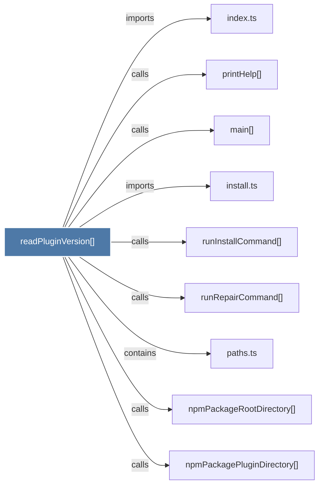

# readPluginVersion()

> [!info] Properties
> **File Type**: code
> **Community**: [[_COMMUNITY_Community None|Community None]]
> **Degree**: 9

## Architecture Graph


## Outbound Connections
- [[index.ts_3]] - `imports` [EXTRACTED]
- [[install.ts]] - `imports` [EXTRACTED]
- [[main()_21]] - `calls` [INFERRED]
- [[npmPackagePluginDirectory()]] - `calls` [EXTRACTED]
- [[npmPackageRootDirectory()]] - `calls` [EXTRACTED]
- [[paths.ts_1]] - `contains` [EXTRACTED]
- [[printHelp()]] - `calls` [INFERRED]
- [[runInstallCommand()]] - `calls` [INFERRED]
- [[runRepairCommand()]] - `calls` [INFERRED]

## Inbound Dependencies
> [!abstract]- Files that link here
```dataview
LIST
FROM [[readPluginVersion()]]
```

#graphify/code #graphify/EXTRACTED #community/Community_None