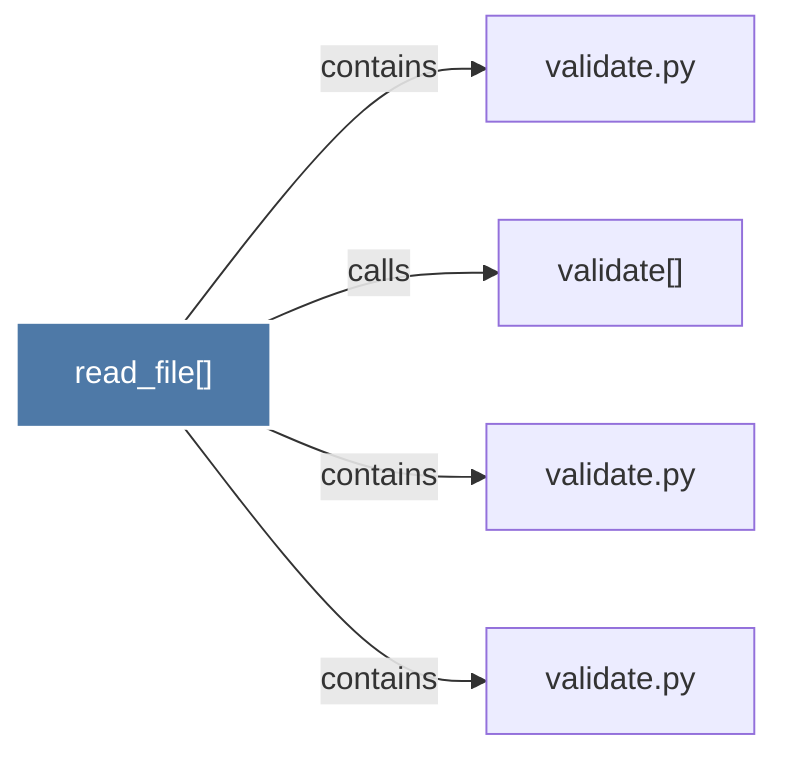

# read_file()

> [!info] Properties
> **File Type**: code
> **Community**: [[_COMMUNITY_Community None|Community None]]
> **Degree**: 4

## Architecture Graph


## Outbound Connections
- [[validate()_2]] - `calls` [EXTRACTED]
- [[validate.py_1]] - `contains` [EXTRACTED]
- [[validate.py_2]] - `contains` [EXTRACTED]
- [[validate.py_3]] - `contains` [EXTRACTED]

## Inbound Dependencies
> [!abstract]- Files that link here
```dataview
LIST
FROM [[read_file()]]
```

#graphify/code #graphify/EXTRACTED #community/Community_None