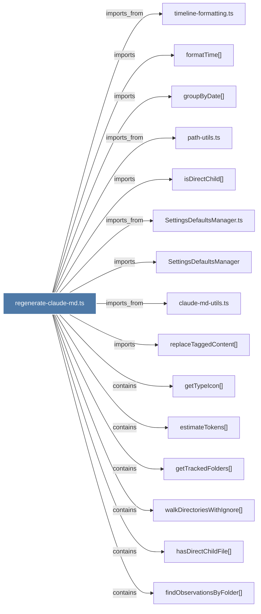

# regenerate-claude-md.ts

> [!info] Properties
> **File Type**: code
> **Community**: [[_COMMUNITY_Community None|Community None]]
> **Degree**: 21

## Architecture Graph


## Outbound Connections
- [[SettingsDefaultsManager]] - `imports` [EXTRACTED]
- [[SettingsDefaultsManager.ts]] - `imports_from` [EXTRACTED]
- [[claude-md-utils.ts]] - `imports_from` [EXTRACTED]
- [[cleanupAutoGeneratedFiles()]] - `contains` [EXTRACTED]
- [[estimateTokens()_2]] - `contains` [EXTRACTED]
- [[extractRelevantFile()_1]] - `contains` [EXTRACTED]
- [[findObservationsByFolder()_1]] - `contains` [EXTRACTED]
- [[formatObservationsForClaudeMd()_1]] - `contains` [EXTRACTED]
- [[formatTime()_1]] - `imports` [EXTRACTED]
- [[getTrackedFolders()_1]] - `contains` [EXTRACTED]
- [[getTypeIcon()_1]] - `contains` [EXTRACTED]
- [[groupByDate()]] - `imports` [EXTRACTED]
- [[hasDirectChildFile()_1]] - `contains` [EXTRACTED]
- [[isDirectChild()]] - `imports` [EXTRACTED]
- [[main()_39]] - `contains` [EXTRACTED]
- [[path-utils.ts]] - `imports_from` [EXTRACTED]
- [[regenerateFolder()_1]] - `contains` [EXTRACTED]
- [[replaceTaggedContent()]] - `imports` [EXTRACTED]
- [[timeline-formatting.ts]] - `imports_from` [EXTRACTED]
- [[walkDirectoriesWithIgnore()_1]] - `contains` [EXTRACTED]
- [[writeClaudeMdToFolderForRegenerate()]] - `contains` [EXTRACTED]

## Inbound Dependencies
> [!abstract]- Files that link here
```dataview
LIST
FROM [[regenerate-claude-md.ts]]
```

#graphify/code #graphify/EXTRACTED #community/Community_None