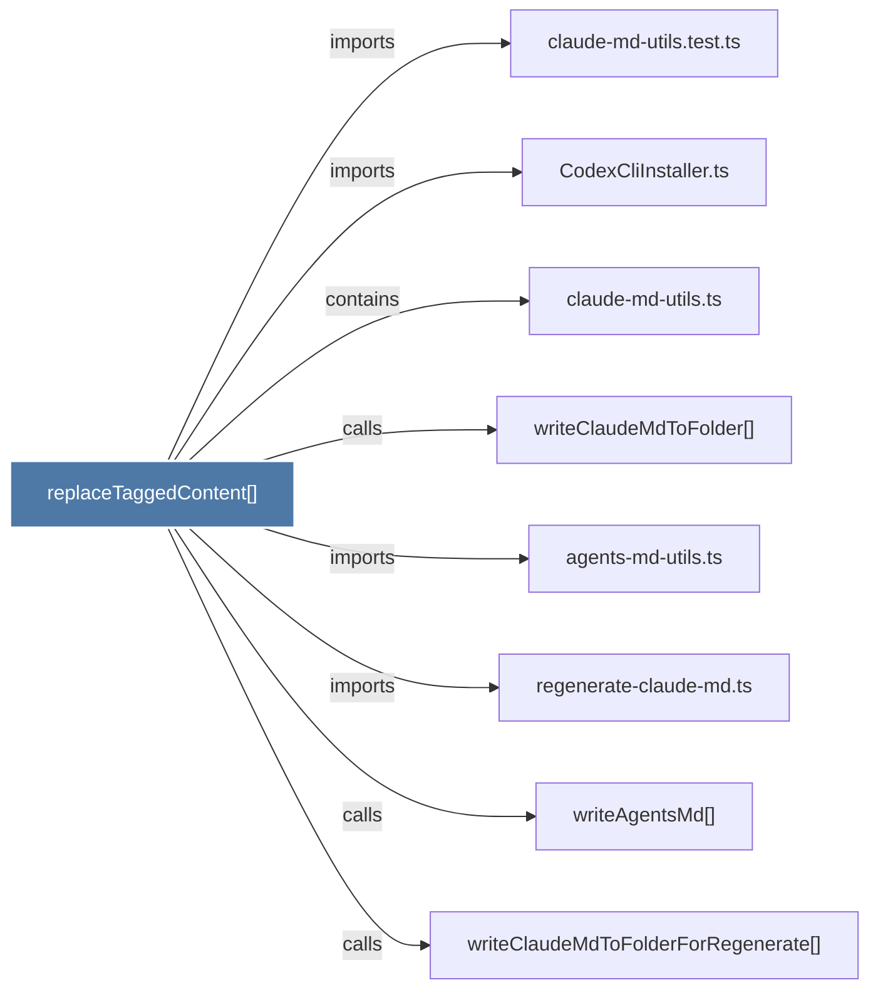

# replaceTaggedContent()

> [!info] Properties
> **File Type**: code
> **Community**: [[_COMMUNITY_Community None|Community None]]
> **Degree**: 8

## Architecture Graph


## Outbound Connections
- [[CodexCliInstaller.ts]] - `imports` [EXTRACTED]
- [[agents-md-utils.ts]] - `imports` [EXTRACTED]
- [[claude-md-utils.test.ts]] - `imports` [EXTRACTED]
- [[claude-md-utils.ts]] - `contains` [EXTRACTED]
- [[regenerate-claude-md.ts]] - `imports` [EXTRACTED]
- [[writeAgentsMd()]] - `calls` [INFERRED]
- [[writeClaudeMdToFolder()_1]] - `calls` [EXTRACTED]
- [[writeClaudeMdToFolderForRegenerate()]] - `calls` [INFERRED]

## Inbound Dependencies
> [!abstract]- Files that link here
```dataview
LIST
FROM [[replaceTaggedContent()]]
```

#graphify/code #graphify/EXTRACTED #community/Community_None