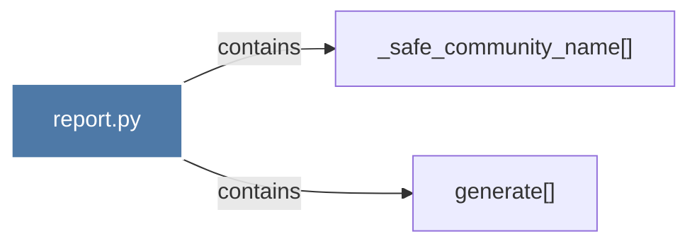

# report.py

> [!info] Properties
> **File Type**: code
> **Community**: [[_COMMUNITY_Community None|Community None]]
> **Degree**: 2

## Architecture Graph


## Outbound Connections
- [[_safe_community_name()]] - `contains` [EXTRACTED]
- [[generate()]] - `contains` [EXTRACTED]

## Inbound Dependencies
> [!abstract]- Files that link here
```dataview
LIST
FROM [[report.py]]
```

#graphify/code #graphify/EXTRACTED #community/Community_None