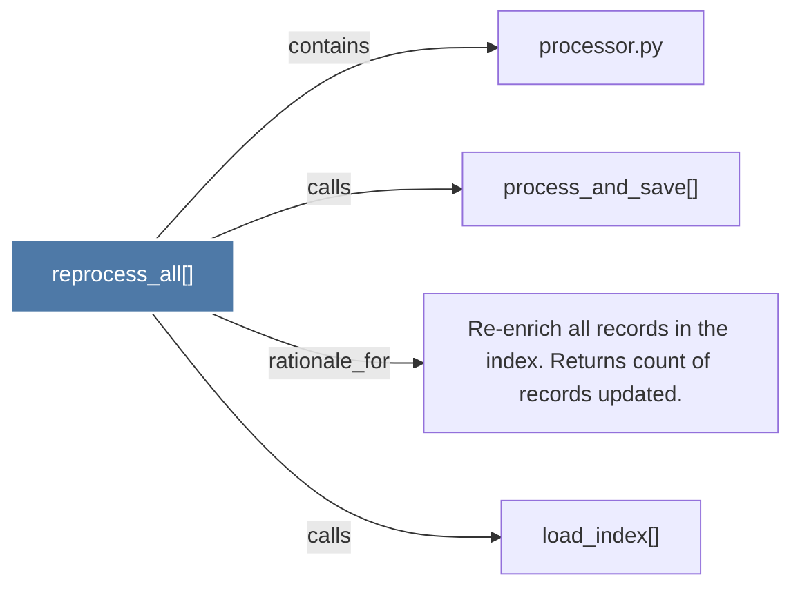

# reprocess_all()

> [!info] Properties
> **File Type**: code
> **Community**: [[_COMMUNITY_Community None|Community None]]
> **Degree**: 4

## Architecture Graph


## Outbound Connections
- [[Re-enrich all records in the index. Returns count of records updated.]] - `rationale_for` [EXTRACTED]
- [[load_index()]] - `calls` [INFERRED]
- [[process_and_save()]] - `calls` [EXTRACTED]
- [[processor.py]] - `contains` [EXTRACTED]

## Inbound Dependencies
> [!abstract]- Files that link here
```dataview
LIST
FROM [[reprocess_all()]]
```

#graphify/code #graphify/EXTRACTED #community/Community_None