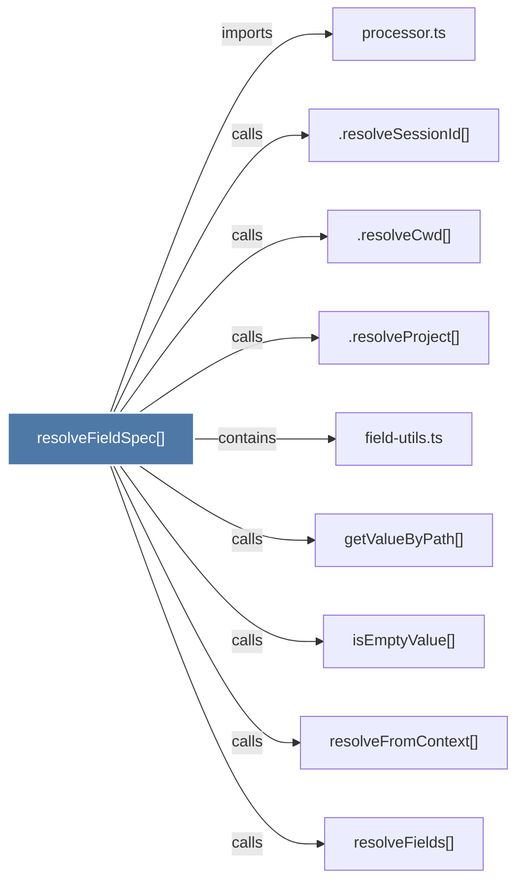

# resolveFieldSpec()

> [!info] Properties
> **File Type**: code
> **Community**: [[_COMMUNITY_Community None|Community None]]
> **Degree**: 9

## Architecture Graph


## Outbound Connections
- [[.resolveCwd()]] - `calls` [INFERRED]
- [[.resolveProject()]] - `calls` [INFERRED]
- [[.resolveSessionId()]] - `calls` [INFERRED]
- [[field-utils.ts]] - `contains` [EXTRACTED]
- [[getValueByPath()]] - `calls` [EXTRACTED]
- [[isEmptyValue()]] - `calls` [EXTRACTED]
- [[processor.ts]] - `imports` [EXTRACTED]
- [[resolveFields()]] - `calls` [EXTRACTED]
- [[resolveFromContext()]] - `calls` [EXTRACTED]

## Inbound Dependencies
> [!abstract]- Files that link here
```dataview
LIST
FROM [[resolveFieldSpec()]]
```

#graphify/code #graphify/EXTRACTED #community/Community_None