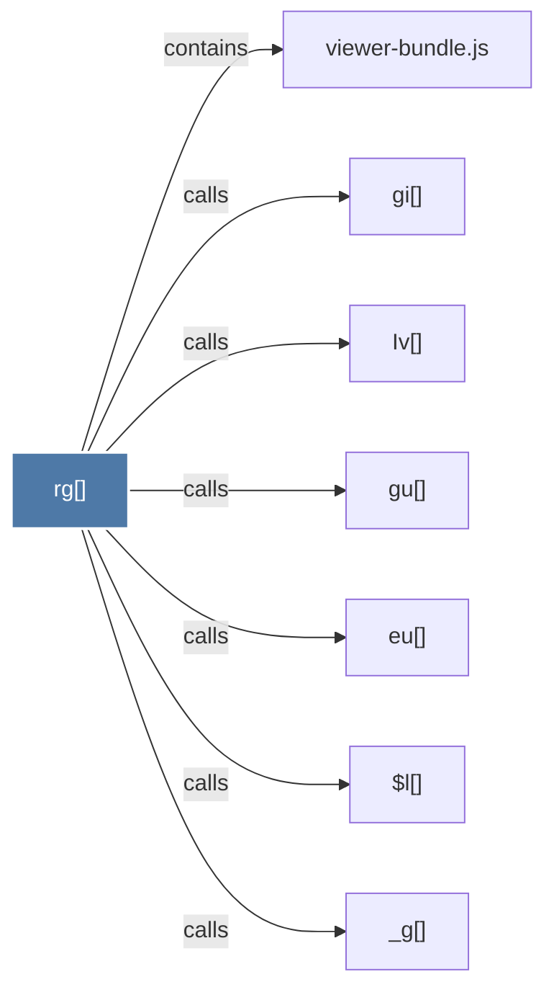

# rg()

> [!info] Properties
> **File Type**: code
> **Community**: [[_COMMUNITY_Community None|Community None]]
> **Degree**: 7

## Architecture Graph


## Outbound Connections
- [[$l()]] - `calls` [EXTRACTED]
- [[Iv()]] - `calls` [EXTRACTED]
- [[_g()]] - `calls` [EXTRACTED]
- [[eu()]] - `calls` [EXTRACTED]
- [[gi()]] - `calls` [EXTRACTED]
- [[gu()]] - `calls` [EXTRACTED]
- [[viewer-bundle.js]] - `contains` [EXTRACTED]

## Inbound Dependencies
> [!abstract]- Files that link here
```dataview
LIST
FROM [[rg()]]
```

#graphify/code #graphify/EXTRACTED #community/Community_None