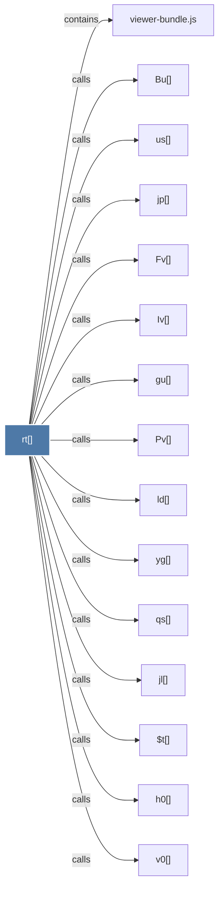

# rt()

> [!info] Properties
> **File Type**: code
> **Community**: [[_COMMUNITY_Community None|Community None]]
> **Degree**: 16

## Architecture Graph


## Outbound Connections
- [[$t()]] - `calls` [EXTRACTED]
- [[Bu()]] - `calls` [EXTRACTED]
- [[Fv()]] - `calls` [EXTRACTED]
- [[Iv()]] - `calls` [EXTRACTED]
- [[Pv()]] - `calls` [EXTRACTED]
- [[getPidInfo()]] - `calls` [INFERRED]
- [[gu()]] - `calls` [EXTRACTED]
- [[h0()]] - `calls` [EXTRACTED]
- [[jl()]] - `calls` [EXTRACTED]
- [[jp()]] - `calls` [EXTRACTED]
- [[ld()]] - `calls` [EXTRACTED]
- [[qs()]] - `calls` [EXTRACTED]
- [[us()]] - `calls` [EXTRACTED]
- [[v0()]] - `calls` [EXTRACTED]
- [[viewer-bundle.js]] - `contains` [EXTRACTED]
- [[yg()]] - `calls` [EXTRACTED]

## Inbound Dependencies
> [!abstract]- Files that link here
```dataview
LIST
FROM [[rt()]]
```

#graphify/code #graphify/EXTRACTED #community/Community_None