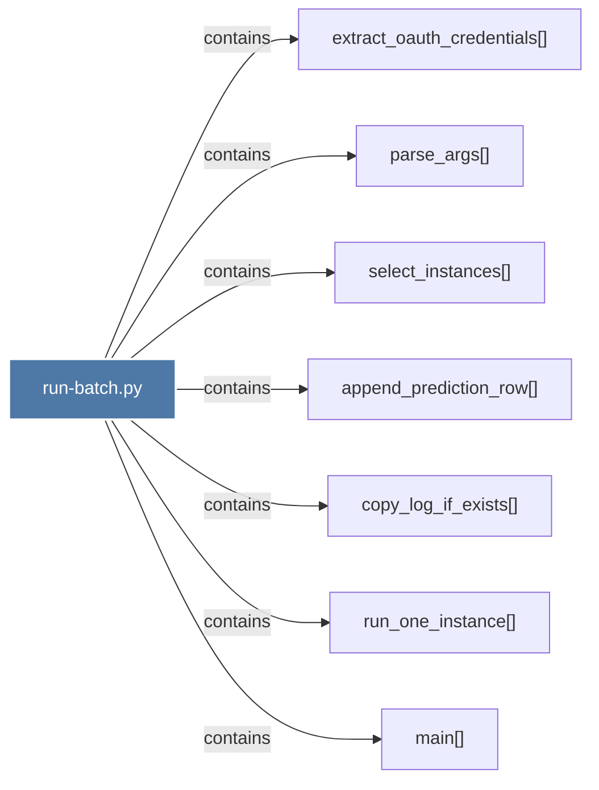

# run-batch.py

> [!info] Properties
> **File Type**: code
> **Community**: [[_COMMUNITY_Community None|Community None]]
> **Degree**: 7

## Architecture Graph


## Outbound Connections
- [[append_prediction_row()]] - `contains` [EXTRACTED]
- [[copy_log_if_exists()]] - `contains` [EXTRACTED]
- [[extract_oauth_credentials()]] - `contains` [EXTRACTED]
- [[main()_27]] - `contains` [EXTRACTED]
- [[parse_args()]] - `contains` [EXTRACTED]
- [[run_one_instance()]] - `contains` [EXTRACTED]
- [[select_instances()]] - `contains` [EXTRACTED]

## Inbound Dependencies
> [!abstract]- Files that link here
```dataview
LIST
FROM [[run-batch.py]]
```

#graphify/code #graphify/EXTRACTED #community/Community_None