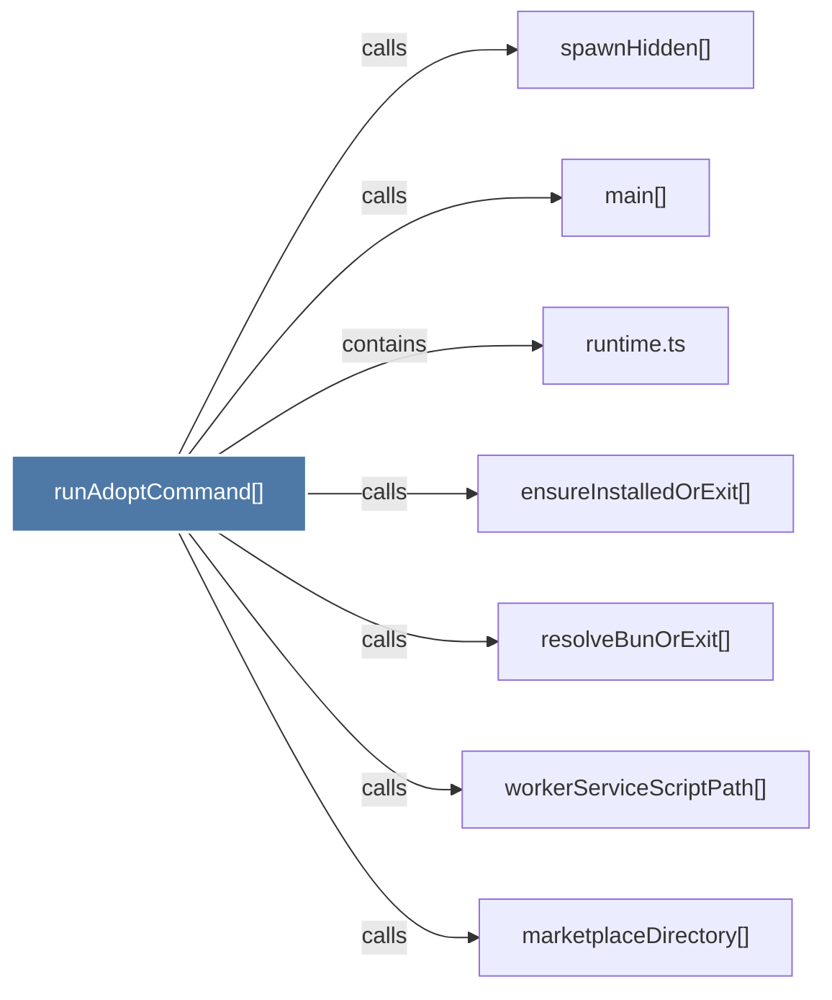

# runAdoptCommand()

> [!info] Properties
> **File Type**: code
> **Community**: [[_COMMUNITY_Community None|Community None]]
> **Degree**: 7

## Architecture Graph


## Outbound Connections
- [[ensureInstalledOrExit()]] - `calls` [EXTRACTED]
- [[main()_21]] - `calls` [INFERRED]
- [[marketplaceDirectory()]] - `calls` [INFERRED]
- [[resolveBunOrExit()]] - `calls` [EXTRACTED]
- [[runtime.ts]] - `contains` [EXTRACTED]
- [[spawnHidden()]] - `calls` [INFERRED]
- [[workerServiceScriptPath()]] - `calls` [EXTRACTED]

## Inbound Dependencies
> [!abstract]- Files that link here
```dataview
LIST
FROM [[runAdoptCommand()]]
```

#graphify/code #graphify/EXTRACTED #community/Community_None