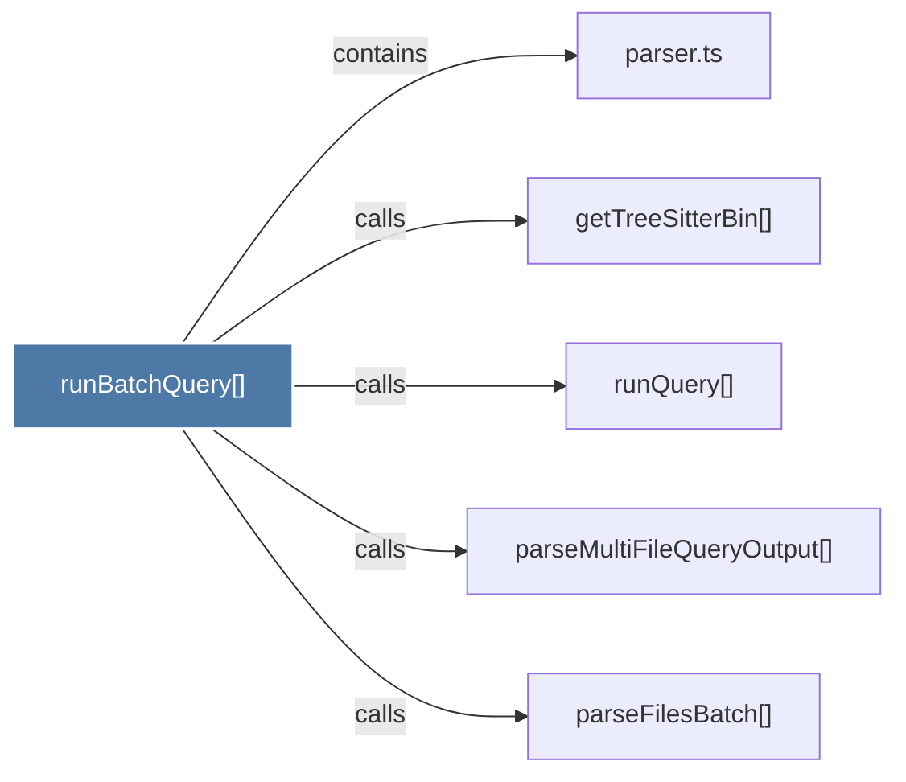

# runBatchQuery()

> [!info] Properties
> **File Type**: code
> **Community**: [[_COMMUNITY_Community None|Community None]]
> **Degree**: 5

## Architecture Graph


## Outbound Connections
- [[getTreeSitterBin()]] - `calls` [EXTRACTED]
- [[parseFilesBatch()]] - `calls` [EXTRACTED]
- [[parseMultiFileQueryOutput()]] - `calls` [EXTRACTED]
- [[parser.ts_1]] - `contains` [EXTRACTED]
- [[runQuery()]] - `calls` [EXTRACTED]

## Inbound Dependencies
> [!abstract]- Files that link here
```dataview
LIST
FROM [[runBatchQuery()]]
```

#graphify/code #graphify/EXTRACTED #community/Community_None