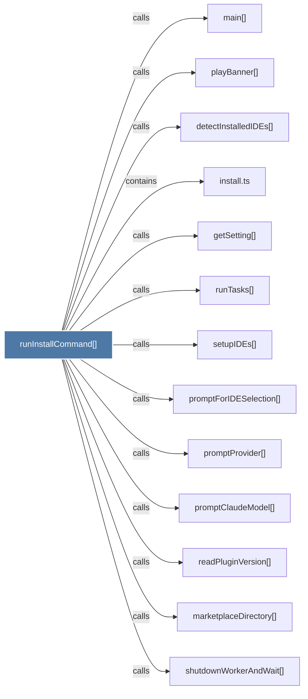

# runInstallCommand()

> [!info] Properties
> **File Type**: code
> **Community**: [[_COMMUNITY_Community None|Community None]]
> **Degree**: 13

## Architecture Graph


## Outbound Connections
- [[detectInstalledIDEs()]] - `calls` [INFERRED]
- [[getSetting()]] - `calls` [EXTRACTED]
- [[install.ts]] - `contains` [EXTRACTED]
- [[main()_21]] - `calls` [INFERRED]
- [[marketplaceDirectory()]] - `calls` [INFERRED]
- [[playBanner()]] - `calls` [INFERRED]
- [[promptClaudeModel()]] - `calls` [EXTRACTED]
- [[promptForIDESelection()]] - `calls` [EXTRACTED]
- [[promptProvider()]] - `calls` [EXTRACTED]
- [[readPluginVersion()]] - `calls` [INFERRED]
- [[runTasks()]] - `calls` [EXTRACTED]
- [[setupIDEs()]] - `calls` [EXTRACTED]
- [[shutdownWorkerAndWait()]] - `calls` [INFERRED]

## Inbound Dependencies
> [!abstract]- Files that link here
```dataview
LIST
FROM [[runInstallCommand()]]
```

#graphify/code #graphify/EXTRACTED #community/Community_None