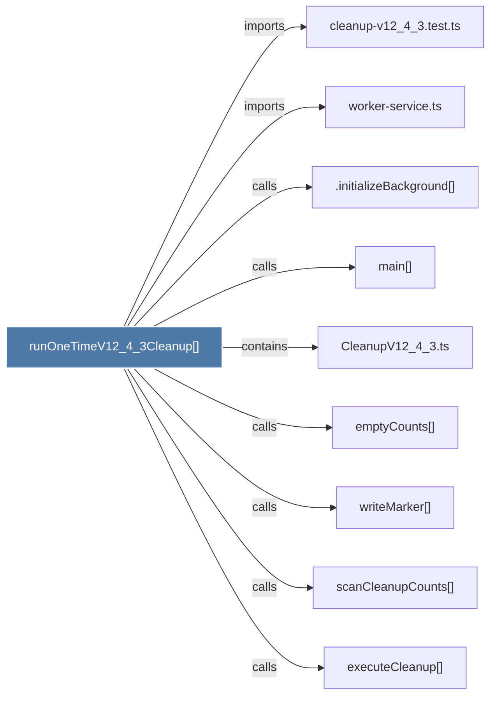

# runOneTimeV12_4_3Cleanup()

> [!info] Properties
> **File Type**: code
> **Community**: [[_COMMUNITY_Community None|Community None]]
> **Degree**: 9

## Architecture Graph


## Outbound Connections
- [[.initializeBackground()]] - `calls` [INFERRED]
- [[CleanupV12_4_3.ts]] - `contains` [EXTRACTED]
- [[cleanup-v12_4_3.test.ts]] - `imports` [EXTRACTED]
- [[emptyCounts()]] - `calls` [EXTRACTED]
- [[executeCleanup()]] - `calls` [EXTRACTED]
- [[main()_22]] - `calls` [INFERRED]
- [[scanCleanupCounts()]] - `calls` [EXTRACTED]
- [[worker-service.ts]] - `imports` [EXTRACTED]
- [[writeMarker()]] - `calls` [EXTRACTED]

## Inbound Dependencies
> [!abstract]- Files that link here
```dataview
LIST
FROM [[runOneTimeV12_4_3Cleanup()]]
```

#graphify/code #graphify/EXTRACTED #community/Community_None