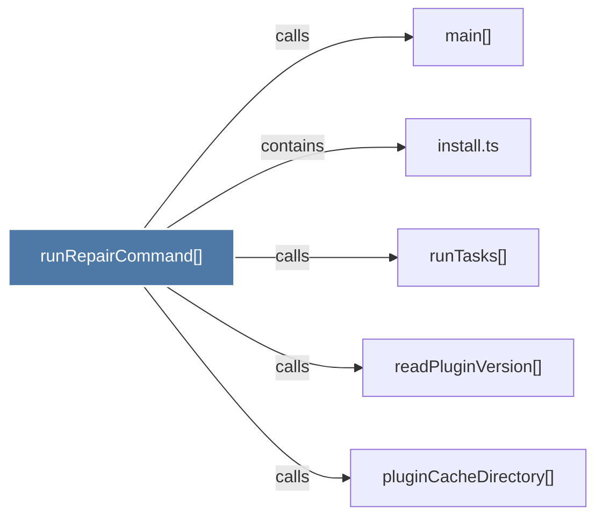

# runRepairCommand()

> [!info] Properties
> **File Type**: code
> **Community**: [[_COMMUNITY_Community None|Community None]]
> **Degree**: 5

## Architecture Graph


## Outbound Connections
- [[install.ts]] - `contains` [EXTRACTED]
- [[main()_21]] - `calls` [INFERRED]
- [[pluginCacheDirectory()]] - `calls` [INFERRED]
- [[readPluginVersion()]] - `calls` [INFERRED]
- [[runTasks()]] - `calls` [EXTRACTED]

## Inbound Dependencies
> [!abstract]- Files that link here
```dataview
LIST
FROM [[runRepairCommand()]]
```

#graphify/code #graphify/INFERRED #community/Community_None