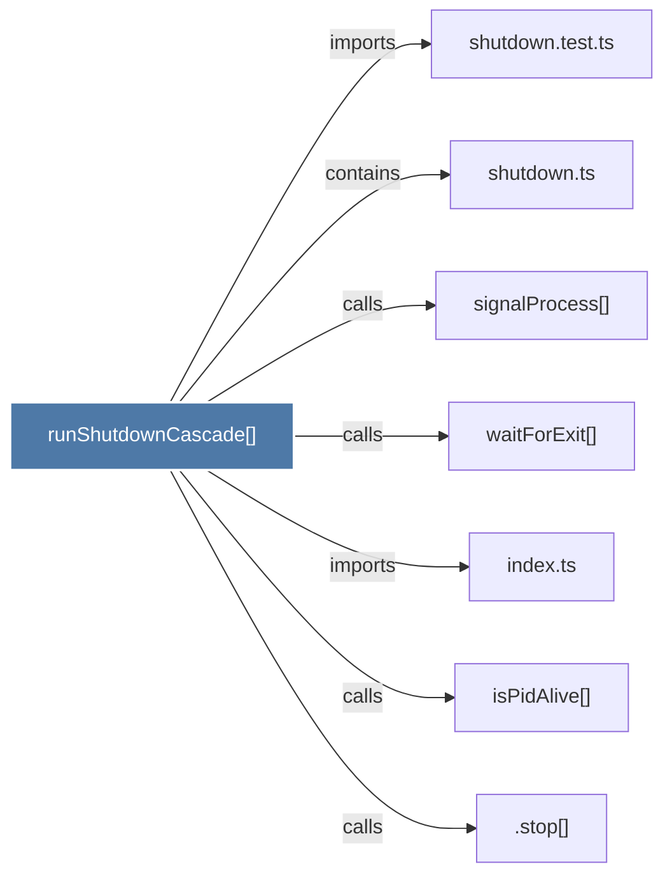

# runShutdownCascade()

> [!info] Properties
> **File Type**: code
> **Community**: [[_COMMUNITY_Community None|Community None]]
> **Degree**: 7

## Architecture Graph


## Outbound Connections
- [[.stop()_2]] - `calls` [INFERRED]
- [[index.ts_11]] - `imports` [EXTRACTED]
- [[isPidAlive()]] - `calls` [INFERRED]
- [[shutdown.test.ts]] - `imports` [EXTRACTED]
- [[shutdown.ts]] - `contains` [EXTRACTED]
- [[signalProcess()]] - `calls` [EXTRACTED]
- [[waitForExit()]] - `calls` [EXTRACTED]

## Inbound Dependencies
> [!abstract]- Files that link here
```dataview
LIST
FROM [[runShutdownCascade()]]
```

#graphify/code #graphify/EXTRACTED #community/Community_None