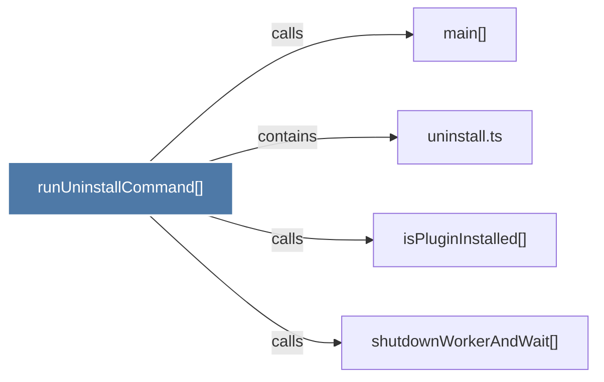

# runUninstallCommand()

> [!info] Properties
> **File Type**: code
> **Community**: [[_COMMUNITY_Community None|Community None]]
> **Degree**: 4

## Architecture Graph


## Outbound Connections
- [[isPluginInstalled()]] - `calls` [INFERRED]
- [[main()_21]] - `calls` [INFERRED]
- [[shutdownWorkerAndWait()]] - `calls` [INFERRED]
- [[uninstall.ts]] - `contains` [EXTRACTED]

## Inbound Dependencies
> [!abstract]- Files that link here
```dataview
LIST
FROM [[runUninstallCommand()]]
```

#graphify/code #graphify/INFERRED #community/Community_None