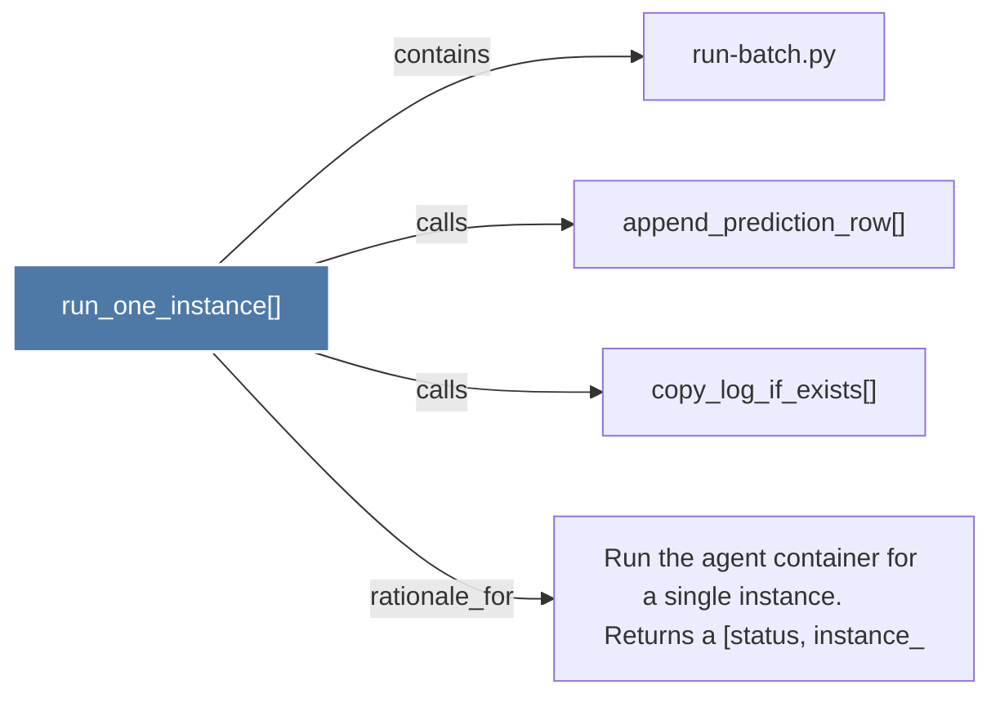

# run_one_instance()

> [!info] Properties
> **File Type**: code
> **Community**: [[_COMMUNITY_Community None|Community None]]
> **Degree**: 4

## Architecture Graph


## Outbound Connections
- [[Run the agent container for a single instance.      Returns a (status, instance_]] - `rationale_for` [EXTRACTED]
- [[append_prediction_row()]] - `calls` [EXTRACTED]
- [[copy_log_if_exists()]] - `calls` [EXTRACTED]
- [[run-batch.py]] - `contains` [EXTRACTED]

## Inbound Dependencies
> [!abstract]- Files that link here
```dataview
LIST
FROM [[run_one_instance()]]
```

#graphify/code #graphify/EXTRACTED #community/Community_None