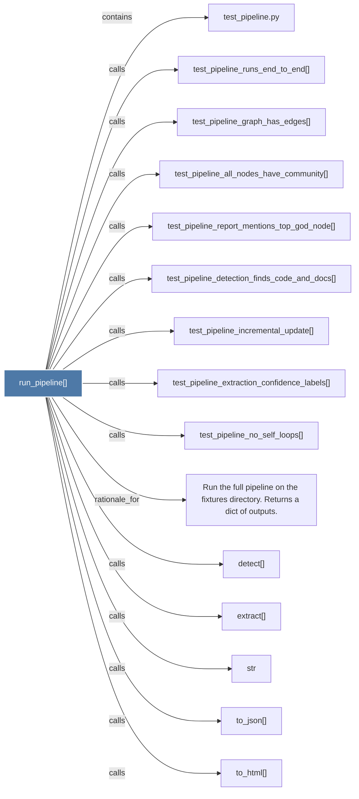

# run_pipeline()

> [!info] Properties
> **File Type**: code
> **Community**: [[_COMMUNITY_Community None|Community None]]
> **Degree**: 17

## Architecture Graph


## Outbound Connections
- [[.list()]] - `calls` [INFERRED]
- [[Run the full pipeline on the fixtures directory. Returns a dict of outputs.]] - `rationale_for` [EXTRACTED]
- [[detect()]] - `calls` [INFERRED]
- [[extract()]] - `calls` [INFERRED]
- [[str]] - `calls` [INFERRED]
- [[test_pipeline.py]] - `contains` [EXTRACTED]
- [[test_pipeline_all_nodes_have_community()]] - `calls` [EXTRACTED]
- [[test_pipeline_detection_finds_code_and_docs()]] - `calls` [EXTRACTED]
- [[test_pipeline_extraction_confidence_labels()]] - `calls` [EXTRACTED]
- [[test_pipeline_graph_has_edges()]] - `calls` [EXTRACTED]
- [[test_pipeline_incremental_update()]] - `calls` [EXTRACTED]
- [[test_pipeline_no_self_loops()]] - `calls` [EXTRACTED]
- [[test_pipeline_report_mentions_top_god_node()]] - `calls` [EXTRACTED]
- [[test_pipeline_runs_end_to_end()]] - `calls` [EXTRACTED]
- [[to_html()]] - `calls` [INFERRED]
- [[to_json()]] - `calls` [INFERRED]
- [[to_obsidian()]] - `calls` [INFERRED]

## Inbound Dependencies
> [!abstract]- Files that link here
```dataview
LIST
FROM [[run_pipeline()]]
```

#graphify/code #graphify/EXTRACTED #community/Community_None