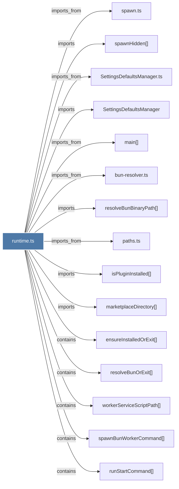

# runtime.ts

> [!info] Properties
> **File Type**: code
> **Community**: [[_COMMUNITY_Community None|Community None]]
> **Degree**: 22

## Architecture Graph


## Outbound Connections
- [[SettingsDefaultsManager]] - `imports` [EXTRACTED]
- [[SettingsDefaultsManager.ts]] - `imports_from` [EXTRACTED]
- [[bun-resolver.ts]] - `imports_from` [EXTRACTED]
- [[ensureInstalledOrExit()]] - `contains` [EXTRACTED]
- [[isPluginInstalled()]] - `imports` [EXTRACTED]
- [[main()_21]] - `imports_from` [EXTRACTED]
- [[marketplaceDirectory()]] - `imports` [EXTRACTED]
- [[paths.ts_1]] - `imports_from` [EXTRACTED]
- [[resolveBunBinaryPath()]] - `imports` [EXTRACTED]
- [[resolveBunOrExit()]] - `contains` [EXTRACTED]
- [[runAdoptCommand()]] - `contains` [EXTRACTED]
- [[runCleanupCommand()]] - `contains` [EXTRACTED]
- [[runRestartCommand()]] - `contains` [EXTRACTED]
- [[runSearchCommand()]] - `contains` [EXTRACTED]
- [[runStartCommand()]] - `contains` [EXTRACTED]
- [[runStatusCommand()]] - `contains` [EXTRACTED]
- [[runStopCommand()]] - `contains` [EXTRACTED]
- [[runTranscriptWatchCommand()]] - `contains` [EXTRACTED]
- [[spawn.ts]] - `imports_from` [EXTRACTED]
- [[spawnBunWorkerCommand()]] - `contains` [EXTRACTED]
- [[spawnHidden()]] - `imports` [EXTRACTED]
- [[workerServiceScriptPath()]] - `contains` [EXTRACTED]

## Inbound Dependencies
> [!abstract]- Files that link here
```dataview
LIST
FROM [[runtime.ts]]
```

#graphify/code #graphify/EXTRACTED #community/Community_None