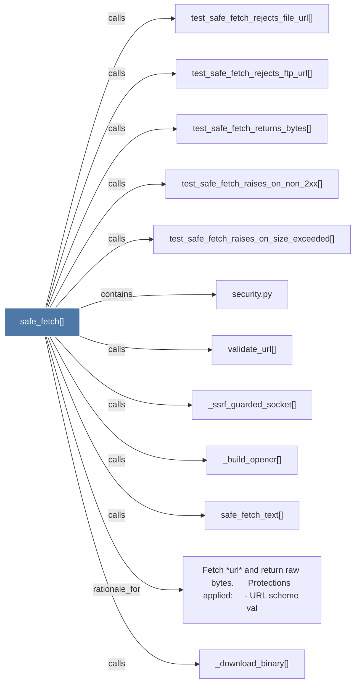

# safe_fetch()

> [!info] Properties
> **File Type**: code
> **Community**: [[_COMMUNITY_Community None|Community None]]
> **Degree**: 12

## Architecture Graph


## Outbound Connections
- [[Fetch url and return raw bytes.      Protections applied     - URL scheme val]] - `rationale_for` [EXTRACTED]
- [[_build_opener()]] - `calls` [EXTRACTED]
- [[_download_binary()]] - `calls` [INFERRED]
- [[_ssrf_guarded_socket()]] - `calls` [EXTRACTED]
- [[safe_fetch_text()]] - `calls` [EXTRACTED]
- [[security.py]] - `contains` [EXTRACTED]
- [[test_safe_fetch_raises_on_non_2xx()]] - `calls` [INFERRED]
- [[test_safe_fetch_raises_on_size_exceeded()]] - `calls` [INFERRED]
- [[test_safe_fetch_rejects_file_url()]] - `calls` [INFERRED]
- [[test_safe_fetch_rejects_ftp_url()]] - `calls` [INFERRED]
- [[test_safe_fetch_returns_bytes()]] - `calls` [INFERRED]
- [[validate_url()]] - `calls` [EXTRACTED]

## Inbound Dependencies
> [!abstract]- Files that link here
```dataview
LIST
FROM [[safe_fetch()]]
```

#graphify/code #graphify/INFERRED #community/Community_None