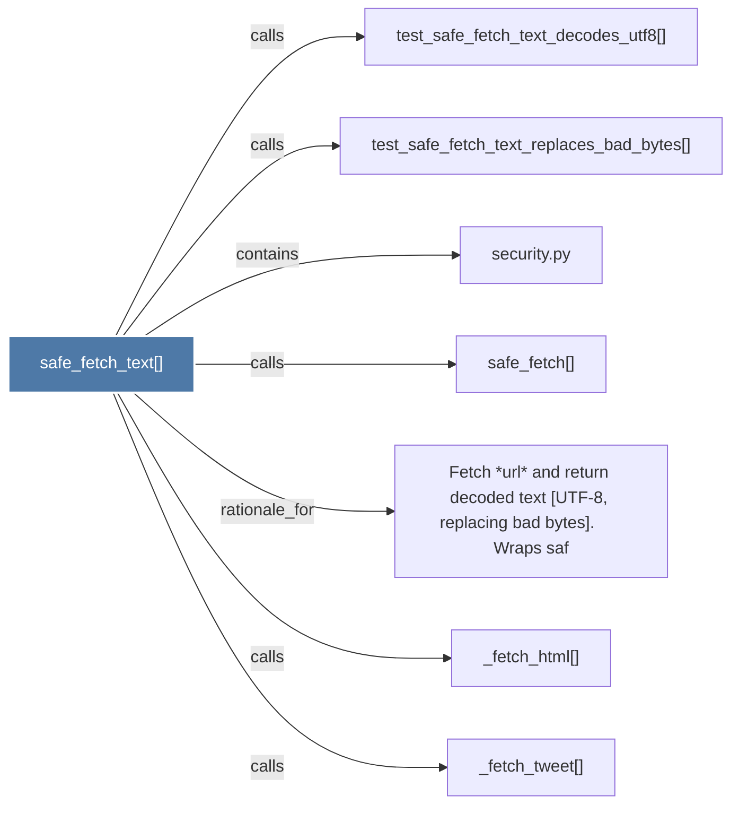

# safe_fetch_text()

> [!info] Properties
> **File Type**: code
> **Community**: [[_COMMUNITY_Community None|Community None]]
> **Degree**: 7

## Architecture Graph


## Outbound Connections
- [[Fetch url and return decoded text (UTF-8, replacing bad bytes).      Wraps saf]] - `rationale_for` [EXTRACTED]
- [[_fetch_html()]] - `calls` [INFERRED]
- [[_fetch_tweet()]] - `calls` [INFERRED]
- [[safe_fetch()]] - `calls` [EXTRACTED]
- [[security.py]] - `contains` [EXTRACTED]
- [[test_safe_fetch_text_decodes_utf8()]] - `calls` [INFERRED]
- [[test_safe_fetch_text_replaces_bad_bytes()]] - `calls` [INFERRED]

## Inbound Dependencies
> [!abstract]- Files that link here
```dataview
LIST
FROM [[safe_fetch_text()]]
```

#graphify/code #graphify/INFERRED #community/Community_None