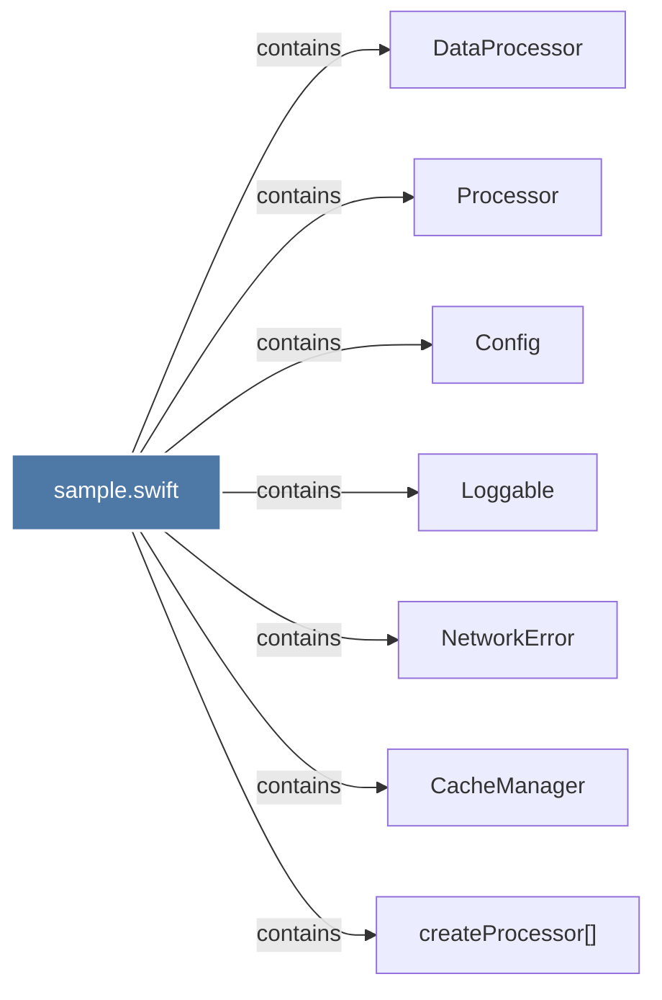

# sample.swift

> [!info] Properties
> **File Type**: code
> **Community**: [[_COMMUNITY_Community None|Community None]]
> **Degree**: 7

## Architecture Graph


## Outbound Connections
- [[CacheManager]] - `contains` [EXTRACTED]
- [[Config]] - `contains` [EXTRACTED]
- [[DataProcessor]] - `contains` [EXTRACTED]
- [[Loggable]] - `contains` [EXTRACTED]
- [[NetworkError]] - `contains` [EXTRACTED]
- [[Processor]] - `contains` [EXTRACTED]
- [[createProcessor()]] - `contains` [EXTRACTED]

## Inbound Dependencies
> [!abstract]- Files that link here
```dataview
LIST
FROM [[sample.swift]]
```

#graphify/code #graphify/EXTRACTED #community/Community_None